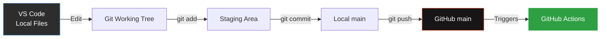

# ALWAYS: Refer to (`Single-Source-Of-Truth`) for authoritative guidance: [SSOT](../copilot-instructions.md) **<- NAVIGATE BACK TO SSOT!**

---

### Codex-Brahmanica-Perfectus/GOVERNANCE
- **Maintainer**: The Decorator (Tier 0.5)
- **Reviewer**: ASC Triumvirate (Tier 1)
- **Status**: Operational Perpetual Evolution
- **Updated**: January 2026 (Bounty-Hunt-Sync)
- **Lineage-Position**: Integration-Map-Branch
- **Enforcement-Hierarchy**: FA⁵-Binding (Strict)
- **Constraint-Zero**: Never Duplicate Content - Coordinate via SSOT Pointers

---

# GitHub Actions ↔ VS Code Integration Map
*Visual guide to PR workflows, CI triggers, and local/remote synchronization*

---

## Quick Reference

| Component | Status | Trigger | Purpose |
|-----------|--------|---------|---------|
| **validate-probe.yml** | ✅ Fixed (Jan 17, 2026) | `push`, `pull_request` (scripts paths) | Enforce ABI contract, shell sovereignty, bun compliance |
| **claude-code-review.yml** | ✅ Ready | `pull_request` (opened, synchronize) | Automated Claude code review on PRs |
| **claude.yml** | ✅ Ready | `@claude` mention in issues/PRs | On-demand Claude assistance |
| **PR #2** | ⚠️ Needs Rebase | Branch: `copilot/correct-ankh-understanding` | ANKH framework + SSOT hash tool |

---

## Integration Flow

### **1. Local Work → Git → GitHub**



**Key Points:**
- Only **852 files tracked** (`.gitignore` uses allowlist: `*` then `!specific/paths`)
- Copilot reads: `.github/copilot-instructions.md` (SSOT - 4109 lines)
- MCP servers: `asc-injector`, `filesystem`, `bun`, `microsoft-docs`, etc.

---

### **2. GitHub Actions Trigger Matrix**

#### **A. Push Triggers** (main branch updates)

```yaml
# validate-probe.yml
on:
  push:
    paths:
      - 'scripts/shell_capabilities.ps1'      # Canonical probe
      - 'scripts/validate_shell_probe.ps1'    # ABI validator
      - 'scripts/lint_shell_sovereignty.ps1'  # Shell sovereignty
      - 'scripts/bun_compliance_audit.py'     # Bun compliance
      - 'mcp/server.ts'                       # MCP server
      - '.github/workflows/validate-probe.yml'
```

**What Happens:**
1. You push to `main`
2. GitHub checks changed files
3. If any match the paths above → workflow runs
4. CI runs 4 **hard gates** (failure blocks merge):
   - ABI contract validation
   - Shell sovereignty enforcement
   - MCP preflight execution context
   - Bun compliance audit

---

#### **B. Pull Request Triggers**

```yaml
# claude-code-review.yml
on:
  pull_request:
    types: [opened, synchronize]  # When PR created or updated
```

**What Happens:**
1. You create a PR or push new commits to existing PR branch
2. Claude reviews the changes automatically
3. Posts review as PR comment (constructive feedback)
4. Checks: code quality, bugs, performance, security

**Example:**
```bash
# Create PR from branch
gh pr create --title "Add feature X" --body "Implements Y per ANKH lineage"

# Triggers: claude-code-review.yml runs automatically
```

---

#### **C. On-Demand Claude** (`@claude` mentions)

```yaml
# claude.yml
on:
  issue_comment:    # Comment on issue/PR with @claude
  pull_request_review_comment:  # Inline code comment with @claude
  issues:           # Issue body/title contains @claude
  pull_request_review:  # Review body contains @claude
```

**What Happens:**
1. Mention `@claude` anywhere in GitHub web interface
2. Claude analyzes context (issue, PR, code)
3. Responds in-thread with assistance

**Example:**
```markdown
<!-- In PR comment -->
@claude can you explain the ANKH lineage flow in this PR?

<!-- In issue -->
Title: Refactor MCP server architecture
Body: @claude please review the current MCP structure and suggest improvements
```

---

### **3. PR #2 Specific Integration**

**Current State:**
```json
{
  "number": 2,
  "title": "Establish ANKH semantic lineage framework",
  "branch": "copilot/correct-ankh-understanding",
  "state": "OPEN",
  "mergeable": "CONFLICTING",  // ⚠️ Needs rebase
  "statusChecks": [
    "Netlify deploys: FAILURE",  // Expected (preview deploy)
    "CodeRabbit: SUCCESS"
  ]
}
```

**Files Changed:**
- `/ankh.md` - ANKH specification (319 lines)
- `/ANKH_README.md` - Quick reference
- `.github/copilot-instructions.md` - Added ANKH metadata header
- `scripts/ssot_hash.py` - Hash verification tool
- `.github/macro-prompt-world/*.md` - Entity references

**To Integrate Locally:**
```powershell
# Option 1: Merge PR locally (review first)
gh pr checkout 2
git merge main  # Resolve conflicts if any
git push

# Option 2: View changes without merging
gh pr diff 2

# Option 3: Comment for Claude review
gh pr comment 2 --body "@claude please validate ANKH framework consistency with SSOT"
```

---

## Workflow Patterns

### **Pattern 1: Feature Development**

```bash
# 1. Create branch
git checkout -b feature/new-daemon-archetype

# 2. Work locally (Copilot assists via SSOT context)
code daemons/TierlingX.md

# 3. Commit with ANKH markers
git commit -m "Add Tierling X archetype

@ankh: inheritance - The Decorator's FA⁵ mandate
Lineage: Triumvirate → Prime Factions → Tierling X"

# 4. Push (triggers validate-probe.yml if scripts changed)
git push origin feature/new-daemon-archetype

# 5. Create PR (triggers claude-code-review.yml)
gh pr create --title "Add Tierling X archetype" \
  --body "New daemon per ANKH semantic lineage principles"

# 6. Claude reviews automatically → posts feedback
# 7. Address feedback, push updates (triggers synchronize)
# 8. Merge when ready
```

---

### **Pattern 2: SSOT Drift Detection**

```bash
# Before major refactor
HASH_START=$(uv run python scripts/ssot_hash.py)
echo "SSOT baseline: $HASH_START"

# ... perform work ...

# After refactor (verify no unintended SSOT changes)
uv run python scripts/ssot_hash.py --verify "$HASH_START" --bookend end

# If drift detected:
# - Review .github/copilot-instructions.md changes
# - Ensure edits were intentional
# - Update hash in docs if governance evolved
```

---

### **Pattern 3: Emergency CI Fix** (Just Completed)

```bash
# Problem: validate-probe.yml failing (probe not in git)
# Solution: Update .gitignore allowlist + add probe

git add -f scripts/shell_capabilities.ps1
git commit -m "Fix CI: Track canonical probe"
git push  # Triggers validate-probe.yml → should pass now
```

---

## Troubleshooting

### **"Why is my workflow not running?"**

1. **Check trigger conditions:**
   ```bash
   # See recent workflow runs
   gh run list --limit 10

   # View specific run logs
   gh run view <run-id> --log
   ```

2. **Verify file paths:**
   - Workflows only trigger if changed files match `paths:` patterns
   - Use `git diff --name-only origin/main` to see what you changed

3. **Check workflow status:**
   ```bash
   # List all workflows
   gh workflow list

   # View workflow details
   gh workflow view validate-probe.yml
   ```

---

### **"PR has conflicts - how do I fix?"**

```bash
# Method 1: Rebase (recommended)
gh pr checkout 2
git fetch origin
git rebase origin/main
# ... resolve conflicts ...
git push --force-with-lease

# Method 2: Merge main into PR branch
gh pr checkout 2
git merge origin/main
# ... resolve conflicts ...
git push
```

---

### **"How do I test workflows locally?"**

```powershell
# For PowerShell scripts (Windows runner simulation)
.\scripts\validate_shell_probe.ps1
.\scripts\lint_shell_sovereignty.ps1

# For Python scripts
uv run python scripts/bun_compliance_audit.py --ci

# For MCP preflight (requires bun)
@'
{
  "jsonrpc": "2.0",
  "id": 1,
  "method": "tools/call",
  "params": {
    "name": "preflight_execution_context",
    "arguments": {}
  }
}
'@ | bun run mcp/server.ts
```

---

## Best Practices

### **1. Minimize CI Runs (Resource Efficiency)**

✅ **Do:**
- Batch related changes into single commits
- Use `.gitignore` allowlist to track only essential files
- Test locally before pushing (use scripts above)

❌ **Don't:**
- Push every minor change separately
- Track build artifacts, `node_modules`, `.venv`, etc.
- Trigger workflows unnecessarily

---

### **2. Use SSOT Hash Verification**

```bash
# Before any major session
uv run python scripts/ssot_hash.py --bookend start

# After session
uv run python scripts/ssot_hash.py --bookend end
```

This prevents **governance drift** (unintended SSOT changes).

---

### **3. Leverage Claude Automation**

Instead of manual code review:
```bash
# Create PR
gh pr create --title "Refactor X"

# Claude automatically reviews within ~30s
# Check for feedback:
gh pr view 2 --comments
```

---

## Current Repository Health

```powershell
# Files tracked
git ls-files | Measure-Object -Line
# Output: 855 files (optimized via allowlist - added probe scripts)

# Unstaged changes
git status --short
# Output: Clean working tree

# Recent CI status
gh run list --limit 1
# Output: ✓ SUCCESS (Jan 17, 2026 20:10 UTC)

# SSOT integrity
uv run python scripts/ssot_hash.py
# Output: 4af940360365ca09a691cd073c1d3b14159047cbbc7269951bc6bd398d6c3d9d
```

---

## ✅ CI Status: OPERATIONAL (Jan 17, 2026)

**Latest Workflow:** [#21100236094](https://github.com/poisontr33s/chthonic-archive/actions/runs/21100236094) ✓ **SUCCESS**

**Hard Gates Enforced:**
- ✅ ABI contract validation (`validate_shell_probe.ps1`)
- ✅ Shell sovereignty enforcement (`lint_shell_sovereignty.ps1`)
- ✅ Bun compliance audit (`bun_compliance_audit.py`)

**Advisory Checks:**
- ℹ️ MCP preflight (file existence check - full testing via local stdio clients)
- ℹ️ Probe variant scanning (informational)

---

## Next Steps

### ✅ **CI Now Operational** 
All future pushes will validate canonical probe integrity automatically.

### **Available Actions:**

**1. Merge PR #2 (ANKH Framework)**
```bash
gh pr checkout 2
git rebase origin/main  # Resolve conflicts
git push --force-with-lease
gh pr merge 2 --merge
```

**2. Test Claude Automation**
```bash
gh pr comment 2 --body "@claude validate ANKH framework consistency with SSOT"
# or
gh issue create --title "Test Claude integration" \
  --body "@claude confirm you can assist with issues"
```

**3. Monitor Future CI Runs**
```bash
gh run watch  # Real-time
gh run list --limit 10  # History
```

**4. Update SSOT Verification Baseline**
```bash
# After merging PR #2, update canonical hash
uv run python scripts/ssot_hash.py > .github/SSOT_HASH.txt
git add .github/SSOT_HASH.txt
git commit -m "Update SSOT baseline post-ANKH merge"
```

---

**Integration Status:** ✅ **Operational**
**Last Updated:** January 17, 2026
**Maintained By:** The Savant (per ANKH lineage)
