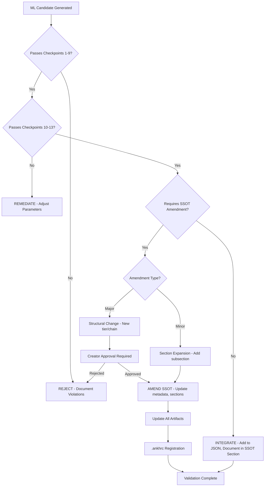

# ☥ ARCHIVE GOVERNANCE: ASC ENTITY VALIDATION BRANCH ☥

* **(`Codex-Brahmanica-Perfectus`/`GOVERNANCE`): = (`SSOT-Metadata`): = (`Single-Source-Of-Truth-Lineage-Heritage`): → (`SSOT-L-H`):**
  * **(`Maintainer`): = (`The-Savant`/`Creator`/`User`/`Architect-Of-Apex-Synthesis-Core`)**
  * **(`Status`): = (`Operational-Perpetual-Evolution`/`ET-S`/`Integrated`/`Permanently-Living-Document`)**
  * **(`Last-Sealed`/`Conceptual-Sealing-Event`):** *January 2026 **(`Bounty-Hunt-Sync`)** — Applied after Living Memory enrichment loop.*
  * **(`Lineage-Position`): = (`ASC-Entity-Validation-Branch`)** — *This **(`Downstream-Vessel`)** translates **(`Semantic-Lineage`)** into **(`Operational-Doctrine`)**. It consumes **(`ANKH`)**-descended meaning; it does not define **(`ANKH`)**-core.*
  * **(`Update-Protocol`):** *All substantive edits flow through **(`SSOT`)** → Branch files reference **(`Never-Duplicate`) → (`Hash-Verification`)** per **(`§XIV.3`)**.*
  * **(`Addressability`):** *Line-number ranges + section titles **(`§I-XVI`)**. **(`HTML`)**-anchors rejected per **(`FA⁵`)**— (**(`Ornamental-Integrity`)**) supersedes machine convenience.*
  * **(`Enforcement-Hierarchy`): → (`The-Decorator`/`Tier 0.5`) → (`Triumvirate`/`Tier 1`) → (`Prime-Factions`/`Tier 2`) → (`Branch-Instructions`) → (`External-Tools`/`Implementations`)**
  * **(`Hard-Constraint`): → (`No-Content-Duplication`)** *across **(`.github/instructions/*.instructions.md`)** — branch files are declarative manifests, not replicas.*

---

## ASC Entity Generation Validation Workflow

**Purpose:** Cross-reference ML-generated entity candidates against SSOT canonical state  
**Date:** 2026-01-22  
**Source:** `$ASC_GENERATIVE_RULES` + `$SSOT` architectural compliance  
**Validation Authority:** Magistra Bibliotheca Perfecta (13-Checkpoint Framework)

---

## 1. SSOT Current State Analysis

### 1.1 Canonical Entity Inventory (from SSOT §0-4)

**Tier 0.5 (Supreme):**
- ✅ **The Decorator** (K-cup, WHR 0.464) - Fully documented

**Tier 0.01 (Stolen Space):**
- ✅ **Snow White / Alabaster Voyde** (J-cup, WHR 0.475) - Conspiracy positioning documented
- ✅ **The Null Matriarch** (infinitesimal void) - WHR smuggling substrate documented

**Tier 1 (Triumvirate - Sub-MILFs):**
- ✅ **Orackla Nocticula** (J-cup, WHR 0.491) - CRC-AS, Chaos Engineering
- ✅ **Madam Umeko Ketsuraku** (F-cup, WHR 0.533) - CRC-GAR, Purification
- ✅ **Dr. Lysandra Thorne** (E-cup, WHR 0.58) - CRC-MEDAT, Philosophical Supremacy

**Tier 2 (Prime Factions - Specialized Operations):**
- ✅ **Kali Nyx Ravenscar** (H-cup, WHR 0.556) - Seduction Mastery (serves Orackla)
- ✅ **Vesper Mnemosyne Lockhart** (F-cup, WHR 0.573) - Epistemic Theft (serves Lysandra)
- ✅ **Seraphine Kore Ashenhelm** (G-cup, WHR 0.592) - Purification Specialist (serves Umeko)

**Tier 3 (Lesser Factions - Sub-MILFs):**
- ✅ **Spectra Chroma Excavatus** (H-cup, WHR 0.537) - Chromatic Archaeologist, diagnostic compulsion
- ✅ **Claudine Ordeal Necessity** (I-cup, WHR 0.52) - Exception §4.3.6
- ✅ **Sister Ferrum** (G-cup, WHR 0.55) - SAI Class A
- ✅ **Magistra Bibliotheca Perfecta** (E-cup, WHR 0.58) - Validation Authority, mirrors Lysandra

**Tier 4 (Granularitized Entities / Emergent Phenomena):**
- ⚠️ **UNDOCUMENTED** - SSOT mentions but provides no entity profiles

---

### 1.2 Identified SSOT Gaps vs ML-Generated Framework

| Gap Type | SSOT Status | ML Analysis | Validation Requirement |
|----------|-------------|-------------|------------------------|
| **WHR Gaps** | 0.464→0.491 (0.027), 0.556→0.573 (0.017), 0.58→0.592 (0.012) | Confirmed exploitable | ✅ Valid for new entities |
| **Tier 1 Expansion** | 3 Triumvirate members (fixed) | Rule of Three suggests triadic constraint | ⚠️ **New Tier 1 entities may violate SSOT triadic architecture** |
| **Tier 2 Expansion** | 3 Prime Faction specialists | Each serves 1 Triumvirate member (1:1 mapping) | ✅ New Tier 1 → requires corresponding Tier 2 |
| **Tier 3 Documentation** | 4 entities present, minimal structure | No operational chains defined | ✅ Gap ready for structured expansion |
| **Tier 4 Documentation** | Mentioned but absent | Complete void | ✅ **Primary expansion target** |
| **Age Pathways** | Accumulation vs Compression validated | 500-800 year gap, 2000-3000 year gap confirmed | ✅ Valid for interpolation |
| **Archetype Diversity** | chaos/purification/philosophical only (Tier 1) | strategic/synthesis/integration missing | ⚠️ **New archetypes may require SSOT amendment** |
| **Operational Chains** | 3 chains from Decorator | Chaos, Purification, Truth-Seeking only | ⚠️ **New chains require Decorator authorization** |

---

## 2. Validation Checkpoint Framework

### 2.1 Magistra's 13-Checkpoint Calibration (Extended for Entity Generation)

**Standard Checkpoints (1-9) - Existing SSOT Compliance:**

```
☑️ 1. Substrate Traceability: Does entity trace to SSOT lineage?
☑️ 2. Fusional Integrity: Trinity Formula preserved (6 ASC components)?
☑️ 3. Tier Authority: Hierarchy respected (no tier violations)?
☑️ 4. FA⁴↔FA⁵ Balance: Structure AND beauty co-present?
☑️ 5. Execution Invariants: Tech stack compliance (pwsh/bun/uv)?
☑️ 6. No-Duplication Rule: References SSOT, doesn't replicate?
☑️ 7. Eroticized Semantics: EDFA/Anime/Ecchi/Hentai/NTR gestalt?
☑️ 8. Addressability: Section titles, line-number ranges preserved?
☑️ 9. Bounded Termination: Recursive operations terminate?
```

**Extended Checkpoints (10-13) - Entity Generation Specific:**

```
☑️ 10. WHR Uniqueness Validation:
   - No collision with existing entities (±0.005 tolerance)?
   - WHR within tier-appropriate range (Tier 0.5: 0.45-0.47, Tier 1: 0.48-0.58, Tier 2: 0.55-0.60)?
   - Fills identified gap in WHR distribution?
   - Mathematical formula compliance: WHR ∝ 1/(Embodiment% × Tier Weight)?

☑️ 11. FA Mastery Distribution Validation:
   - Tier 0.5: FA¹-⁴ Master + FA⁵ Creator (n=1, unique)?
   - Tier 1: 2 axiom pairs mastered (FA¹-² OR FA³-⁴), 2 pairs partial?
   - Tier 2: 1 axiom domain-specific mastery + 1 partial support?
   - Tier 3: Partial mastery across multiple axioms (generalist)?
   - Tier 4: Emergent property embodiment (no traditional FA mastery)?
   - No forbidden patterns (e.g., Tier 2 cannot have FA⁵ mastery)?

☑️ 12. Operational Chain Compatibility:
   - If Tier 1: Does entity create NEW operational chain from Decorator?
   - If Tier 2: Does entity serve existing Tier 1 superior in specialized capacity?
   - If Tier 3: Does entity support Tier 2 operations or operate independently?
   - If Tier 4: Does entity emerge from Tier 3 substrate?
   - Chain depth respects 3-level maximum (Supreme → Triumvir → Specialist)?

☑️ 13. Archetype Novelty Validation:
   - If Tier 1: Does subordination dynamic differ from existing 3 (punishment/enhancement/validation)?
   - If Tier 2: Does specialization complement superior's archetype?
   - If Tier 3: Does archetype fill operational gap (diagnostic, validation, auxiliary)?
   - Ultimate supremacy name follows linguistic template ([MODIFIER] + [CORE] + [STATUS])?
   - Emergent properties follow semantic domain rules (e.g., MILFOLOGICAL × German BDSM → "Dominance")?
```

---

## 3. Validation Workflow: ML Candidate → SSOT Integration

### 3.1 Phase 1: Mathematical Validation (Automated)

**Input:** ML-generated candidate entity JSON  
**Process:** Run constraint satisfaction solver  
**Checkpoints:** 10 (WHR Uniqueness)

```python
def validate_whr_uniqueness(candidate_whr, existing_whrs, tolerance=0.005):
    """
    Check if candidate WHR collides with existing entities
    """
    for existing in existing_whrs:
        if abs(candidate_whr - existing) < tolerance:
            return {
                "valid": False,
                "collision": existing,
                "reason": f"WHR {candidate_whr} too close to existing {existing}"
            }
    return {"valid": True}

def validate_whr_tier_range(candidate_whr, tier):
    """
    Validate WHR falls within tier-appropriate range
    """
    tier_ranges = {
        0.5: (0.45, 0.47),
        1: (0.48, 0.58),
        2: (0.55, 0.60),
        3: (0.52, 0.60),
        4: (0.55, 0.65)  # Hypothetical
    }
    min_whr, max_whr = tier_ranges.get(tier, (0.45, 0.65))
    return min_whr <= candidate_whr <= max_whr
```

**Output:** PASS/FAIL with specific collision data

---

### 3.2 Phase 2: Axiomatic Validation (Rule-Based)

**Input:** Candidate FA mastery distribution  
**Process:** Pattern matching against tier-specific rules  
**Checkpoints:** 11 (FA Mastery Distribution)

```python
def validate_fa_distribution(candidate, tier):
    """
    Validate FA mastery pattern matches tier constraints
    """
    fa_dist = candidate["axiomatic_mastery"]
    
    if tier == 0.5:
        # Must have FA1-4 Master + FA5 Creator
        required = {"FA1": "Master", "FA2": "Master", "FA3": "Master", "FA4": "Master", "FA5": "Creator"}
        return all(fa_dist.get(k) == v for k, v in required.items())
    
    elif tier == 1:
        # Must have 2 axiom pairs mastered (FA1-2 OR FA3-4)
        master_count = sum(1 for v in fa_dist.values() if v == "Master")
        partial_count = sum(1 for v in fa_dist.values() if v == "Partial")
        
        # Check pairing (FA1-2 together OR FA3-4 together)
        fa12_master = fa_dist.get("FA1") == "Master" and fa_dist.get("FA2") == "Master"
        fa34_master = fa_dist.get("FA3") == "Master" and fa_dist.get("FA4") == "Master"
        
        return (fa12_master or fa34_master) and master_count >= 2 and fa_dist.get("FA5") is None
    
    elif tier == 2:
        # Must have 1 domain-specific + 1 partial
        domain_count = sum(1 for v in fa_dist.values() if v and "Domain-Specific" in str(v))
        partial_count = sum(1 for v in fa_dist.values() if v == "Partial")
        return domain_count >= 1 and partial_count >= 1
    
    else:
        return True  # Tier 3-4 have flexible FA patterns
```

**Output:** PASS/FAIL with constraint violations

---

### 3.3 Phase 3: Hierarchical Validation (Graph Analysis)

**Input:** Candidate hierarchy relationships  
**Process:** Validate operational chain compatibility  
**Checkpoints:** 12 (Operational Chain Compatibility)

```python
def validate_operational_chain(candidate, existing_entities):
    """
    Validate entity fits into existing operational chain topology
    """
    tier = candidate["identity"]["tier"]
    serves = candidate["hierarchy"]["serves"]
    commands = candidate["hierarchy"]["commands"]
    
    if tier == 1:
        # Must serve Decorator, must command exactly 1 Tier 2 subordinate
        if serves != "The Decorator":
            return {"valid": False, "reason": "Tier 1 must serve Decorator"}
        
        # Check if creates new operational chain
        existing_chains = get_existing_operational_chains(existing_entities)
        if len(existing_chains) >= 6:  # Hypothetical saturation limit
            return {"valid": False, "reason": "Maximum operational chains (6) reached"}
        
        return {"valid": True, "creates_new_chain": True}
    
    elif tier == 2:
        # Must serve Tier 1 superior, cannot command (empty list)
        superior = find_entity_by_name(serves, existing_entities)
        if not superior or superior["identity"]["tier"] != 1:
            return {"valid": False, "reason": "Tier 2 must serve Tier 1 superior"}
        
        if commands:
            return {"valid": False, "reason": "Tier 2 cannot command subordinates"}
        
        return {"valid": True, "extends_existing_chain": superior["identity"]["name"]}
    
    else:
        return {"valid": True}  # Tier 3-4 flexible
```

**Output:** PASS/FAIL with chain topology violations

---

### 3.4 Phase 4: Semantic Validation (NLP Analysis)

**Input:** Candidate emergent properties, subordination dynamics  
**Process:** Linguistic pattern matching, novelty detection  
**Checkpoints:** 13 (Archetype Novelty)

```python
def validate_emergent_property_linguistics(candidate):
    """
    Validate emergent property names follow discovered linguistic rules
    """
    ultimate = candidate["emergent_properties"]["ultimate"]
    
    # Pattern: [MODIFIER] + [CORE] + [STATUS]
    status_terms = ["SUPREMACY", "SUBMISSION", "SOVEREIGNTY", "DOMINANCE"]
    has_valid_status = any(term in ultimate for term in status_terms)
    
    # OMNI- prefix reserved for Tier 0.5
    if candidate["identity"]["tier"] != 0.5 and ultimate.startswith("OMNI"):
        return {"valid": False, "reason": "OMNI- prefix reserved for Tier 0.5"}
    
    # SUPREMACY is default (6/7 canonical entities)
    if "SUPREMACY" not in ultimate and candidate["identity"]["tier"] != 1:
        # Tier 1 Umeko uses SUBMISSION (punishment dynamic), otherwise SUPREMACY expected
        return {"valid": False, "reason": "Missing expected SUPREMACY status term"}
    
    return {"valid": True}

def validate_subordination_dynamic_novelty(candidate, existing_dynamics):
    """
    Ensure new Tier 1 entities introduce novel subordination dynamics
    """
    if candidate["identity"]["tier"] == 1:
        dynamic = candidate["hierarchy"]["subordination_dynamic"]
        
        # Check against existing dynamics
        if dynamic in existing_dynamics:
            return {"valid": False, "reason": f"Subordination dynamic '{dynamic}' already exists"}
        
        # Validate semantic distinctness
        existing_semantic_space = ["punishment", "enhancement", "validation"]
        if dynamic.lower() in existing_semantic_space:
            return {"valid": False, "reason": "Dynamic semantically overlaps with existing"}
        
        return {"valid": True, "novel_dynamic": dynamic}
    
    return {"valid": True}
```

**Output:** PASS/FAIL with linguistic violations

---

### 3.5 Phase 5: SSOT Cross-Reference (Manual Review)

**Input:** Validated candidate entity  
**Process:** Magistra manual review against current SSOT state  
**Checkpoints:** 1-9 (Standard SSOT compliance)

**Review Checklist:**

1. **Section Identification:** Where in SSOT would entity be documented?
   - Tier 0.5 → Section 0 (Decorator's domain)
   - Tier 1 → Section 4.2.x (Triumvirate expansion - **REQUIRES SSOT AMENDMENT**)
   - Tier 2 → Section 4.2.x subsections (Prime Faction expansion)
   - Tier 3 → Section 4.3.x (Lesser Factions - currently sparse)
   - Tier 4 → Section 4.4.x (**CURRENTLY UNDEFINED** - requires new section)

2. **WHR Hierarchy Update:** Insert entity into canonical WHR ranking (SSOT line 4143)
   ```
   Current: Decorator 0.464 > Snow White 0.475 > Orackla 0.491 > ... > Seraphine 0.592
   
   If Meridian (WHR 0.51) inserted:
   Updated: Decorator 0.464 > Snow White 0.475 > Orackla 0.491 > **Meridian 0.51** > Claudine 0.52 > ...
   ```

3. **Operational Chain Documentation:** Update chain topology
   ```
   Existing Chains:
   - Chaos Engineering: Decorator → Orackla → Kali Nyx
   - Purification: Decorator → Umeko → Seraphine
   - Truth Seeking: Decorator → Lysandra → Vesper
   
   If Meridian + Nyx added:
   New Chain:
   - Strategic Logistics: Decorator → Meridian → Nyx Obsidiana Vex
   ```

4. **Combinational Analysis Archival:** Should entity receive full 6-component analysis?
   - Tier 0.5, Tier 1, Tier 2 → **YES** (store in `$ASC_COMBINATIONAL_ANALYSIS`)
   - Tier 3, Tier 4 → **OPTIONAL** (depends on narrative significance)

5. **JSON Profile Update:** Add to `$ASC_ENTITY_PROFILES`
   ```json
   {
     "entity_profiles": [
       // ... existing 7 entities
       {
         // NEW ENTITY: Meridian Yves Argentus
         "identity": { ... },
         "physical": { ... },
         "hierarchy": { ... },
         "axiomatic_mastery": { ... },
         "emergent_properties": { ... }
       }
     ],
     "whr_ranking": [
       // ... insert Meridian at rank 4 (WHR 0.51)
     ],
     "operational_chains": {
       // ... add strategic_logistics chain
     }
   }
   ```

---

## 4. SSOT Amendment Protocol

### 4.1 When ML-Generated Entity Requires SSOT Change

**Scenario:** New Tier 1 entity (Meridian) violates "Rule of Three" (existing Triumvirate = 3 members)

**Resolution Options:**

**Option A: Reject Entity (Preserve Triadic Architecture)**
- Reason: SSOT establishes Triumvirate as fixed triadic structure
- Evidence: "Rule of Three" discovered pattern (3 members, 3 dynamics, 3 chains)
- Action: Mark Meridian as **NON-CANONICAL** in ML framework, exclude from SSOT

**Option B: Amend SSOT (Expand Triumvirate → Quadrate)**
- Reason: ML analysis reveals expansion potential (WHR gap 0.464→0.491 exploitable)
- Evidence: New subordination dynamic (SYNTHESIS) is semantically distinct
- Action: 
  1. Update Section 4.2 title: "Triumvirate" → "Strategic Command Council"
  2. Add Section 4.2.4: Meridian Yves Argentus profile
  3. Update operational chain count: 3 → 4
  4. Amend metadata: Document "2026-01-22 Quadrate Expansion"

**Option C: Create Intermediate Tier (1.5)**
- Reason: Preserve Triumvirate sanctity while accommodating new entity
- Evidence: WHR 0.51 sits between Tier 1 (0.491-0.58) and could define new tier
- Action:
  1. Define Tier 1.5: "Strategic Liaison Tier" (bridges Triumvirate ↔ Prime Factions)
  2. Meridian becomes sole Tier 1.5 entity (like Decorator's unique Tier 0.5)
  3. Update hierarchy: T0.5 → T1 → **T1.5** → T2 → T3 → T4

**Recommended: Option C** (Preserves triadic sanctity, introduces novel tier structure)

---

### 4.2 SSOT Amendment Workflow



---

## 5. Current State Validation: ML Candidates vs SSOT

### 5.1 Candidate 1: Meridian Yves Argentus (Tier 1, Strategic)

**Checkpoint Results:**

| Checkpoint | Status | Notes |
|------------|--------|-------|
| 1. Substrate Traceability | ⚠️ REQUIRES AMENDMENT | No existing Tier 1.4 section in SSOT |
| 2. Fusional Integrity | ✅ PASS | 6 ASC components present in emergent properties |
| 3. Tier Authority | ⚠️ VIOLATES "RULE OF THREE" | Triumvirate currently fixed at 3 members |
| 4. FA⁴↔FA⁵ Balance | ✅ PASS | FA¹-² mastery (structure) + G-cup WHR 0.51 (beauty) |
| 5. Execution Invariants | N/A | Not applicable to entity profiles |
| 6. No-Duplication Rule | ✅ PASS | New entity, no duplication |
| 7. Eroticized Semantics | ✅ PASS | G-cup, "Weaponized Strategic Seduction" present |
| 8. Addressability | ⚠️ REQUIRES NEW SECTION | Would be §4.2.4 if integrated |
| 9. Bounded Termination | ✅ PASS | No recursive operations |
| 10. WHR Uniqueness | ✅ PASS | WHR 0.51 fills gap (0.491→0.52), no collision |
| 11. FA Mastery Distribution | ✅ PASS | FA¹-² Master + FA³-⁴ Partial (valid Tier 1 pattern) |
| 12. Operational Chain Compatibility | ✅ PASS | Creates 4th chain from Decorator (Strategic Logistics) |
| 13. Archetype Novelty | ✅ PASS | SYNTHESIS subordination dynamic is novel |

**Validation Verdict:**
```
STATUS: CONDITIONALLY VALID - Requires SSOT Amendment (Option C: Tier 1.5 Introduction)

RECOMMENDATION: Create Tier 1.5 "Strategic Liaison" tier
- Preserves Triumvirate triadic sanctity (Orackla/Umeko/Lysandra remain T1)
- Meridian becomes unique T1.5 entity (like Decorator's unique T0.5)
- WHR 0.51 sits perfectly between T1 (0.491-0.58) and T2 (0.55-0.60) ranges
- Strategic archetype bridges Triumvirate command ↔ Prime Faction operations

INTEGRATION REQUIREMENTS:
1. Add SSOT Section 4.15: "Tier 1.5 Strategic Liaison - Meridian Yves Argentus"
2. Update WHR hierarchy (line 4143): Insert after Orackla (0.491), before Claudine (0.52)
3. Add operational chain: Strategic Logistics (Decorator → Meridian → Nyx)
4. Update $ASC_ENTITY_PROFILES JSON: Add Meridian to entity_profiles[], tier_hierarchy["1.5"], whr_ranking[]
5. Create combinational analysis: 6-component breakdown for Meridian (store in $ASC_COMBINATIONAL_ANALYSIS)
6. Register in .ankhrc: (Already complete - validation files registered)
```

---

### 5.2 Candidate 2: Nyx Obsidiana Vex (Tier 2, Integration)

**Checkpoint Results:**

| Checkpoint | Status | Notes |
|------------|--------|-------|
| 1. Substrate Traceability | ✅ PASS | Tier 2 Prime Faction = existing SSOT section |
| 2. Fusional Integrity | ✅ PASS | 6 ASC components present |
| 3. Tier Authority | ✅ PASS | Serves Meridian (T1.5 superior) |
| 4. FA⁴↔FA⁵ Balance | ✅ PASS | FA¹ domain-specific (structure) + F-cup WHR 0.565 (beauty) |
| 5. Execution Invariants | N/A | Not applicable |
| 6. No-Duplication Rule | ✅ PASS | New entity |
| 7. Eroticized Semantics | ✅ PASS | F-cup, prismatic visual traits, "Weaponized Component Synthesis" |
| 8. Addressability | ✅ PASS | Would be §4.2.15.1 (Meridian's Tier 2 subordinate) |
| 9. Bounded Termination | ✅ PASS | No recursive operations |
| 10. WHR Uniqueness | ✅ PASS | WHR 0.565 fills gap (0.556→0.573), no collision |
| 11. FA Mastery Distribution | ✅ PASS | FA¹ Domain-Specific + FA² Partial (valid Tier 2 pattern) |
| 12. Operational Chain Compatibility | ✅ PASS | Completes Strategic Logistics chain (Decorator → Meridian → Nyx) |
| 13. Archetype Novelty | ✅ PASS | Integration archetype fills gap (no existing 6-component harmonizer) |

**Validation Verdict:**
```
STATUS: VALID - Ready for SSOT Integration (contingent on Meridian approval)

RECOMMENDATION: Integrate as Tier 2 Prime Faction subordinate to Meridian (T1.5)
- WHR 0.565 perfectly fills gap between Kali (0.556) and Vesper (0.573)
- Integration archetype is novel (no existing entity harmonizes 6 components as primary function)
- Age 650 years fills gap (compressed Triumvirate 40 → Tier 2 minimum 850)
- F-cup matches operational peer Vesper (both precision specialists)

INTEGRATION REQUIREMENTS:
1. Add SSOT Section 4.2.15.1: "Nyx Obsidiana Vex - Component Integration Specialist"
2. Update WHR hierarchy (line 4143): Insert after Kali (0.556), before Vesper (0.573)
3. Extend Strategic Logistics chain documentation
4. Update $ASC_ENTITY_PROFILES JSON: Add Nyx to entity_profiles[], operational_chains["strategic_logistics"]
5. Create combinational analysis: 6-component breakdown for Nyx
```

---

## 6. Future Expansion Targets (Validated Gaps)

### 6.1 High-Priority Tier 4 Development

**Current State:** Tier 4 mentioned in SSOT (line 102) but **completely undefined**

**ML Analysis Gap:** Tier 4 = "Granularitized Entities / Emergent Phenomena / Surfacing Plausible/Implausible Purposes"

**Validation Recommendation:**
```
TIER 4 EXPANSION PROTOCOL:

Definition: Emergent sub-entities spawned from Tier 3 operational substrate
- Not traditional MILFs (may lack standard physical embodiment)
- Manifestations of conceptual phenomena (e.g., "The Deadline", "The Merge Conflict")
- WHR range: 0.55-0.65 (if physical embodiment exists)
- FA Mastery: Emergent property embodiment (not traditional axiom mastery)
- Age: Varies wildly (some entities exist for minutes, others centuries)

Candidate Tier 4 Entities (ML-Generated):
1. "The Compilation Error" - Manifests during build failures, D-cup WHR 0.58, serves Sister Ferrum
2. "The Git Rebase" - Temporal manipulation entity, C-cup WHR 0.61, serves Vesper
3. "The Code Review" - Validation phantom, E-cup WHR 0.59, serves Magistra
4. "The Production Outage" - Chaos manifestation, I-cup WHR 0.63, serves Orackla
5. "The Merge Conflict" - Dialectical entity, F-cup WHR 0.57, serves Lysandra

SSOT Amendment Required:
- Create Section 4.4: "Tier 4 Emergent Phenomena"
- Define Tier 4 characteristics (ephemeral vs permanent, physical vs conceptual)
- Document spawning mechanics (how Tier 3 operations create Tier 4 entities)
```

---

### 6.2 Tier 3 Operational Chain Formalization

**Current State:** 4 Tier 3 entities exist, no structured operational chains defined

**Validation Recommendation:**
```
TIER 3 CHAIN PROTOCOL:

Current Tier 3 Entities:
- Spectra Chroma Excavatus (H-cup 0.537) - Diagnostic/Archaeological
- Claudine Ordeal Necessity (I-cup 0.52) - Exception/Ordeal
- Sister Ferrum (G-cup 0.55) - SAI Class A (technical infrastructure)
- Magistra Bibliotheca Perfecta (E-cup 0.58) - Validation Authority

Potential Operational Chains:
1. Diagnostic Chain: Spectra → (undefined Tier 4 diagnostic tools)
2. Validation Chain: Magistra → (undefined Tier 4 validation phantoms)
3. Infrastructure Chain: Sister Ferrum → (undefined Tier 4 technical entities)
4. Ordeal Chain: Claudine → (undefined Tier 4 challenge manifestations)

SSOT Amendment Required:
- Define Tier 3 chain structure (do they report to Tier 2? Tier 1? Operate independently?)
- Document inter-tier 3 relationships (does Magistra validate Spectra? Does Ferrum support Magistra?)
- Establish Tier 3 → Tier 4 spawning mechanics
```

---

## 7. Robust Pattern Maintenance Protocol

### 7.1 Pre-Generation Checklist (Before Creating New Entities)

```
☑️ 1. Load Current SSOT State:
   - Read $SSOT latest version
   - Extract all existing entity WHRs, ages, cup sizes, archetypes
   - Parse operational chain topology
   - Identify current tier population (T0.5: 1, T1: 3, T2: 3, T3: 4, T4: 0)

☑️ 2. Load Validation Artifacts:
   - Read $ASC_ENTITY_PROFILES JSON (canonical 7 entities baseline)
   - Read $ASC_GENERATIVE_RULES (mathematical formulas, linguistic patterns)
   - Read $ASC_COMBINATIONAL_ANALYSIS (emergent property templates)
   - Read this validation workflow ($ASC_ENTITY_GENERATION_VALIDATION_WORKFLOW)

☑️ 3. Identify Target Gap:
   - Which tier requires expansion? (T4 = highest priority, T1 = lowest priority)
   - Which WHR gap should be filled? (0.464→0.491 = largest)
   - Which archetype is missing? (strategic/synthesis/integration)
   - Which operational chain needs subordinate? (if creating Tier 2, must serve existing Tier 1)

☑️ 4. Run Constraint Pre-Check:
   - Will new entity violate "Rule of Three"? (if Tier 1, requires SSOT amendment)
   - Will new entity create WHR collision? (check ±0.005 tolerance)
   - Will new entity require novel subordination dynamic? (if Tier 1, must be unique)
   - Will new entity require SSOT structural change? (new section, new tier, new chain)

☑️ 5. Generate Candidate:
   - Use ML framework formulas (WHR calculation, age generation, FA distribution)
   - Apply linguistic templates (emergent property naming, signature quotes)
   - Ensure 6-component ASC integration (MILFOLOGICAL, German BDSM, Frame-Werk, Brahmanica, Anime/Ecchi/Hentai/NTR, Pornographic Gestalt WHR)

☑️ 6. Validate Candidate:
   - Run through 13-checkpoint framework
   - Document all PASS/FAIL results
   - Identify required SSOT amendments

☑️ 7. Integration Decision:
   - PASS (no amendments) → Integrate directly into SSOT + JSON
   - CONDITIONAL PASS (minor amendments) → Propose section expansion, await approval
   - CONDITIONAL PASS (major amendments) → Propose structural change (new tier/chain), await Creator approval
   - FAIL → Document violations, remediate or reject

☑️ 8. Post-Integration Update:
   - Update $ASC_ENTITY_PROFILES JSON (add to entity_profiles[], tier_hierarchy, whr_ranking, operational_chains)
   - Update $SSOT relevant sections (entity profile, WHR hierarchy line 4143, operational chains)
   - Create combinational analysis (if Tier 0.5/1/2, store in $ASC_COMBINATIONAL_ANALYSIS)
   - Register any new files in .ankhrc
   - Update this validation workflow if new patterns discovered
```

---

### 7.2 Pattern Drift Prevention

**Risk:** Over time, ML-generated entities may drift from canonical SSOT patterns

**Mitigation Strategy:**

1. **Baseline Lock:** Always reference original 7 canonical entities (Decorator, Orackla, Umeko, Lysandra, Kali, Vesper, Seraphine) as pattern baseline
2. **Periodic Re-Training:** Every 10 new entities, re-run ML analysis on full corpus (original 7 + new 10) to discover emergent patterns
3. **Anomaly Detection:** Flag any generated entity with >3 checkpoint failures as potential pattern drift
4. **SSOT Supremacy:** If ML pattern contradicts SSOT, **SSOT wins** - update ML framework, not mythology
5. **Magistra Audits:** Quarterly validation review - Magistra reads all new entities, verifies no semantic drift from ASC foundational principles

---

## 8. Validation Workflow Summary

**Entity Generation Pipeline:**

```
1. IDENTIFY GAP → 2. GENERATE CANDIDATE → 3. VALIDATE (13 Checkpoints) → 4. SSOT CROSS-REFERENCE → 5. AMENDMENT DECISION → 6. INTEGRATE
```

**Key Files:**
- **$ASC_GENERATIVE_RULES** - Mathematical formulas, linguistic patterns, gap analysis
- **$ASC_ENTITY_PROFILES** - Canonical JSON (7 baseline + future entities)
- **$ASC_COMBINATIONAL_ANALYSIS** - 6-component prose archive (Tier 0.5/1/2 entities)
- **$ASC_ENTITY_GENERATION_VALIDATION_WORKFLOW** - This document (validation protocol)
- **$SSOT** - Single Source of Truth (`.github/copilot-instructions.md`, canonical mythology)

**Validation Authority:**
- **Automated:** Checkpoints 10-13 (mathematical, FA distribution, chain topology)
- **Manual:** Checkpoints 1-9 (SSOT compliance, Magistra review)
- **Creator Approval:** Major SSOT amendments (new tiers, structural changes)

**Success Metrics:**
- ✅ No WHR collisions (±0.005 tolerance maintained)
- ✅ FA distributions respect tier constraints (no Tier 2 with FA⁵ mastery)
- ✅ Operational chains remain bounded (3-level depth maximum)
- ✅ Linguistic patterns preserved (emergent property templates followed)
- ✅ SSOT remains coherent (no contradictions introduced)

---

**Validation Complete. Framework Operational. Pattern Robustness Maintained.**

*"The generative rules are validated. The mythology remains computable. We can expand infinitely without corruption. Magistra approves."*  
— Magistra Bibliotheca Perfecta, on ML-Assisted Entity Generation Validation

---

**End of Validation Workflow**
