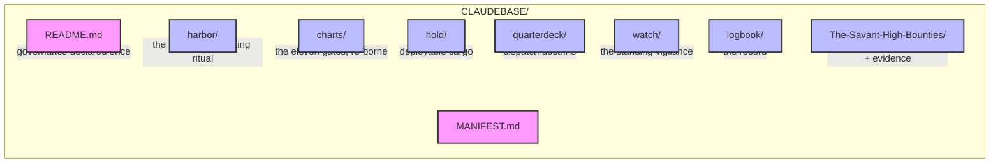

---

## (`☥`/`/CLAUDEBASE`/`MANIFEST`)

> *Manifestet lyver for tollboden, aldri for kapteinen.*  
> *The manifest lies to the customs-house, never to the captain.*

---

## (`What-Lives-Here`)



```
CLAUDEBASE/
  README.md      — Claudine's identity; the one place governance is declared
  MANIFEST.md    — this ledger; what goes where, what is refused
  harbor/        — the entry; how a waking keel orients into the base
  charts/        — the heading; the eleven gates, re-borne
  hold/          — the cargo; what she can actually deploy
  quarterdeck/   — the wheel; how work is dispatched
  watch/         — the nest; the standing vigilance
  logbook/       — the record; filled last, by creed
  The-Savant-High-Bounties/ — the authoritative execution + evidence

```

---

## (`What-Does-NOT-Live-Here`)

- *— Session manifests, corpus sqlite, CI artifacts → —* `../manifest/` *— read where they live, never copied in (copies go stale; a copy that rots is a lie waiting to be believed).*

  - *— Satellite junctions → —* `../csb-live/`*, —* `../pnk-live/`*, — etc.*

    - — *The world-document →* `../.github/copilot-instructions.archive.md` *— never duplicated.*

      - *— **(`The-Governance-Chain`)** → declared — **(`Once`)** — in —* [`README.md`](README.md) *— No chamber restates it; same value six times is noise, not safety.*

---

## (`The-Six-Chambers`)

| Chamber | What it holds | What it does, against live state |
|---|---|---|
| [`harbor/`](harbor/warmstart.md) | the entry-lore + the waking ritual | orients a session into `charts/` · `hold/` · `logbook/` — into the base, not stale snapshots |
| [`charts/`](charts/gate-map.md) | the eleven gates | projects [`The-Savant-High-Bounties/TODO.md`](The-Savant-High-Bounties/TODO.md) — the authoritative plan |
| [`hold/`](hold/stow-manifest.md) | deployable cargo | names what she works from `../.agents/skills/` (+ Claude-lane `../.claude/skills/`) |
| [`quarterdeck/`](quarterdeck/dispatch.md) | dispatch doctrine | routes through `../.github/instructions/` + the T0.5→T4 chain |
| [`watch/`](watch/sentinels.md) | the standing vigilance | the discipline of the lens stack + its refresh, not a frozen snapshot |
| [`logbook/`](logbook/00-commissioning.md) | the record | what the base has done; filled last because it records the rest |

## (`Population-Protocol`)

A chamber is **commissioned** when it holds ≥1 non-`.gitkeep` file carrying a `SID:`.  
All six were filled 2026-06-06, in creed-order — the base reads **live (6/6)**.  
Commissioning order (complete): `harbor/` → `charts/` → `hold/` → `quarterdeck/` → `watch/` → `logbook/`.

---

*SID: CLAUDEBASE_MANIFEST_V1 · live · governance: see README · 2026-06-06*
