# (`☥`/`CLAUDEBASE`/`TOPOLOGY`)

> *Et kart tegnet tre ganger på samme papir er ikke tre kart. Det er ett kart som glemte at det allerede fantes.*

  > *A chart drawn three times on the same paper is not three charts. It is one chart that forgot it already existed.*

---

## (`Her-Reckoning`)

This is the one live rendering of CLAUDEBASE's shape — facing files and chambers. It replaces three broken, duplicated mermaid/YAML pastes that had accumulated in [`CLAUDE.md`](../CLAUDE.md) across repair attempts, each one left in place instead of replacing the last.

Data lives in [`CLAUDEBASE.yaml`](../CLAUDEBASE.yaml) only — this chart draws it, it does not restate it. If the two ever disagree, the YAML is the coast; this diagram is the error.

```mermaid
flowchart TB
    repo["chthonic-archive"]
    ssot["../.chthonic/SSOT.md"]
    base["CLAUDEBASE/"]

    repo --> base
    ssot --> base

    subgraph faces["Facing Papers"]
        readme["README.md<br/>identity, governance, directory tongue"]
        manifest["MANIFEST.md<br/>ledger, chamber doctrine, tenant register"]
        agents["AGENTS.md<br/>local agent routing"]
        common["AGENTS_COMMON.md<br/>shared conduct substrate"]
        claude["CLAUDE.md<br/>Claudine-facing witness chart"]
        cline["CLINE.md<br/>tool-calling quay lane"]
        codex["Codex.md<br/>Codex lane, newly berthed"]
        geminii["GEMINIi.md<br/>Gemini continuity anchor"]
        freeagency["The-Savant-Free-Agency-Logging.md<br/>claims board and pickup ledger"]
        backup["CLAUDE.md.bak<br/>older backup, not live law"]
    end

    subgraph chambers["Live Chambers"]
        harbor["harbor/<br/>warm starts, arrivals, handoffs, resumption anchors"]
        logbook["logbook/<br/>commissioning, retrospectives, what the base remembers"]
        charts["charts/<br/>gates, bathymetry, celestial fields, migration and salvage maps"]
        hold["hold/<br/>stowed cargo, quarantines, deployable base material"]
        watch["watch/<br/>sentinels, MCP fleet notes, error ledgers"]
        quarterdeck["quarterdeck/<br/>dispatch doctrine, barometer, cosmos, standards"]
        bounties["The-Savant-High-Bounties/<br/>TODO, GRILLING, evidence, heavy project packs"]
        claudie["claudie/<br/>Claude notebook, dated resident journal"]
        cross["cross-instance-sync/<br/>relay packets, corrections, DR commissions"]
        subsurface["sub-surface-skinny-dipping/<br/>external returns from below the waterline"]
        mythic["Mythic-Contract/<br/>forensics dossier, worked diagnostic cases"]
        usables["usables/<br/>project nursery, assessments, pre-emigration berths"]
        study["study-books-below-mast/<br/>linguistic and prompt-register study shelf"]
    end

    base --> readme
    base --> manifest
    base --> agents
    base --> common
    base --> claude
    base --> cline
    base --> codex
    base --> geminii
    base --> freeagency
    base -. archive .-> backup

    base --> harbor
    base --> logbook
    base --> charts
    base --> hold
    base --> watch
    base --> quarterdeck
    base --> bounties
    base --> claudie
    base --> cross
    base --> subsurface
    base --> mythic
    base --> usables
    base --> study

    readme --> manifest
    agents --> common
    claude --> manifest
    cline --> quarterdeck
    codex --> quarterdeck
    geminii --> cross
    freeagency --> harbor

    harbor --> logbook
    charts --> bounties
    hold --> usables
    watch --> quarterdeck
    cross --> subsurface
    mythic --> charts
    study --> claude

    classDef root fill:#fff7e8,stroke:#6f4e23,stroke-width:2px,color:#1f160a;
    classDef file fill:#f8f2ff,stroke:#6b4a82,stroke-width:1px,color:#21122c;
    classDef dir fill:#edf8ff,stroke:#2d6478,stroke-width:1px,color:#0e2b36;
    classDef archive fill:#f2f2f2,stroke:#777,stroke-dasharray:4 3,color:#333;

    class repo,ssot,base root;
    class readme,manifest,agents,common,claude,cline,codex,geminii,freeagency file;
    class backup archive;
    class harbor,logbook,charts,hold,watch,quarterdeck,bounties,claudie,cross,subsurface,mythic,usables,study dir;
```

---

*Promoted from `dummy.md` (Codex, 2026-07-06). The diagram was sound and is carried forward unchanged; the YAML copy pasted alongside it in that file was not — it reproduced the same syntax breaks already repaired in `CLAUDEBASE.yaml`, so it was not promoted. `dummy.md` itself is superseded by this file and by the `CLAUDEBASE.yaml` fix; it is not a chamber and is left for the owner to archive or delete.*

---
