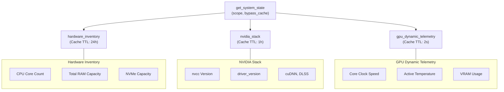

# Comprehensive Architectural Report: Integrating a High-Performance Hardware Environment MCP Server inside the Chthonic Archive Infrastructure

## Comparative Analysis of System Interfaces: Native Rust WMI vs. PowerShell Subprocess

Architecting system diagnostics for high-frequency runtime queries in the Windows 11 Pro N environment using Rust 1.96.0 requires selecting an efficient interface. The choice between launching an external PowerShell 7.5 subprocess to run hardware-info-probe.ps1 and natively accessing Windows Management Instrumentation (WMI) via COM bindings using the wmi crate directly impacts the Model Context Protocol (MCP) server's latency

#### Execution Path Comparison

PowerShell Subprocess: [rmcp Server] ──(std::process::Command)──► [pwsh.exe] ──► [Dotnet CLR Engine] ──► [System Query] ──► [Stdout JSON]
Latency: 300ms – 800ms
Native Rust WMI: [rmcp Server] ──(WMI Connection / COM)──► [CIMV2 Services] ──► [Direct Deserialization]
Latency: < 15ms

#### Operational Comparison Data

#### To establish a clear baseline for this architectural decision, the operational differences between these two approaches are summarized below:

| Architectural Vector | PowerShell Subprocess (pwsh 7.5) | Native Rust WMI (wmi-rs 0.18.4) |
| :---- | :---- | :---- |
| Startup Latency | ![][image1] to ![][image2] per call3 | ![][image3] (pre-warmed COM connection)4 |
| System Overhead | Multi-threaded VM initialization, .NET loading | Lightweight COM library activation within the target thread |
| Stdout Risk | High; potential stream corruption from profile echos5 | None; results are deserialized natively via memory structures7 |
| Compilation Targets | Direct dependency on external PowerShell executables | Compiles natively for x86_64-pc-windows-msvc [cite: 1, 9] |
| Execution Safety | Handled via OS process isolation boundaries | Thread safety requires careful COM apartment model tracking10 |

Spawning a pwsh.exe subprocess via std::process::Command introduces significant startup latency3. On Windows 11 Pro N, launching PowerShell forces the operating system to create a virtual memory space, load the .NET CLR, parse environment variables, and map loaded modules. This process regularly takes between ![][image4] and ![][image2], even with the -NoProfile and -NonInteractive flags active3.
If a user's local PowerShell configuration includes long initialization steps, startup latency can exceed ![][image5] or trigger shell timeout limits, degrading the responsiveness of interactive Claude Code loops6. Furthermore, external process execution introduces a risk of stdout pollution5. Any unexpected warning, system update notification, or module initialization message printed to stdout corrupts the underlying JSON-RPC stream, causing the MCP client to disconnect5.
Using the native wmi crate (version 0.18.4 on crates.io) avoids these process startup costs1. The crate connects directly to the system's IWbemServices interface using Windows COM bindings, allowing it to retrieve system metrics in less than ![][image6]1. It compiles cleanly on the target x86_64-pc-windows-msvc using standard platform headers, requiring no manual C/C++ tooling configuration or external linker setups1.
The structural coverage offered by the native wmi crate across the target system diagnostic classes is comprehensive:

* Win32_Processor: Returns detailed CPU specifications, including cores, threads, maximum clock frequencies, and unique manufacturer hardware IDs15.
* Win32_PhysicalMemory: Provides precise capacities and clock speeds for each populated memory slot on the motherboard15.
* Win32_DiskDrive: Identifies active drive boundaries and raw partition structures, though querying specific NVMe diagnostic fields requires bypassing WMI to use direct storage control codes15.
* Win32_VideoController: Retrieves basic driver names and active device descriptions15. However, this interface is limited by a legacy signed 32-bit representation of video memory (AdapterRAM), causing it to misreport or cap VRAM at 4 GB on modern GPUs such as the RTX 409019.

Despite its performance benefits, integrating native COM bindings into a multi-threaded Tokio asynchronous runtime (used by rmcp 1.7) introduces threading complexities10. The COMLibrary abstraction triggers CoUninitialize when dropped10. In multi-threaded environments, if a background worker thread drops this resource while sibling threads are performing WinRT operations via windows-rs, it can cause unexpected memory unmapping and process-level access violations10.
To prevent these threading errors, the MCP server must initialize COM using a persistent, single-threaded apartment model or use CoIncrementMTAUsage at application startup to ensure the COM library remains mapped for the lifetime of the process10.

### Recommendation

The system must use native Rust WMI queries for CPU, motherboard, RAM, and storage inventory tracking. The significant startup latency of PowerShell subprocesses is unacceptable for interactive developer query loops. Any COM initialization risks must be mitigated by using a persistent, thread-safe COM worker channel, isolating WMI query lifetimes from the primary Tokio thread pool10.

---

## Tool Schema Design and Stateful Caching Architecture

When designing tool interfaces for large-scale language models, maintaining a minimal namespace footprint is key to ensuring tool selection accuracy22. Providing separate entry points for minor system diagnostics increases context window consumption and degrades model steering performance once the toolset exceeds a critical size22.
To address this, the hardware and software layers must be consolidated into a single tool named get_system_state.

---




To support this consolidated entry point, a tiered caching engine is used to balance system performance with data freshess. Hardware metrics are divided into three distinct lifecycle tiers:

* Static Hardware Inventory: Properties like CPU models, motherboard identifiers, and total memory capacity do not change while the system is running. These are assigned a cache TTL of 24 hours.
* Semi-Static Software Stack: Environment variables, driver configurations, and SDK paths (such as the Vulkan SDK or CUDA toolkits) only change during system updates. These are assigned a cache TTL of 1 hour.
* Dynamic GPU Telemetry: Real-time metrics such as clock frequencies, temperatures, VRAM consumption, and active load parameters change constantly25. These are assigned a cache TTL of 2 seconds to prevent stale values from affecting profiling decisions.

The schema for the consolidated get_system_state tool is structured as follows:

```json
{
  "name": "get_system_state",
  "description": "Retrieves the structural hardware environment state of the host system, including CPU configurations, physical memory, active storage drives, installed NVIDIA SDK versions (CUDA, cuDNN, DLSS), and dynamic GPU telemetry metrics.",
  "inputSchema": {
    "type": "object",
    "properties": {
      "scope": {
        "type": "string",
        "enum": ["all", "hardware_inventory", "nvidia_stack", "gpu_dynamic_telemetry"],
        "description": "Specifies the hardware segment to query. Defaults to 'all'."
      },
      "bypass_cache": {
        "type": "boolean",
        "description": "If set to true, forces a direct query of physical sensors, bypassing the on-disk cache.",
        "default": false
      }
    },
    "required": []
  }
}
```

The server parameter struct is modeled in Rust using the schemars serialization bindings20:

```rust
use serde::Deserialize;
use schemars::JsonSchema;

#[derive(Deserialize, JsonSchema, Debug)]
pub struct SystemStateParams {
    /// Specifies the hardware segment to query. 'hardware_inventory' targets physical system components.
    /// 'nvidia_stack' targets driver versions and installed SDK environments.
    /// 'gpu_dynamic_telemetry' targets high-frequency metrics such as core utilization and temperature.
    pub scope: Option<String>,
    /// If set to true, forces a direct raw hardware query and bypasses the structured file-based JSON cache.
    pub bypass_cache: Option<bool>,
}
```

When called, get_system_state inspects the cache files stored in .chthonic/cache/. If the file is missing, older than the specified TTL, or if bypass_cache is set to true, a fresh system probe is triggered, saving the updated values back to the disk. Otherwise, the cached configuration is read and returned immediately. This approach keeps tool execution latency low during repetitive model interactions while still allowing developers to request real-time telemetry on demand27.

### Recommendation

A single, consolidated tool get_system_state must be used instead of split utility tools. This design minimizes model context pollution22, simplifies tool discovery via Claude Code's lazy-loading index23, and uses a tiered caching strategy with TTLs ranging from 2 seconds to 24 hours to balance efficiency with data accuracy.

## Environment Drift Detection and Reference Verification System

When compiling Vulkan or CUDA applications, system updates, driver changes, or local DLL modifications can cause version drift. This drift can introduce subtle compatibility errors or performance regressions.
To help developers verify their environment, the hw_drift_check tool compares live system parameters with baseline specifications defined in the workspace's documentation.

```text
Workspace Reference Base Files (e.g. COMPUTE_FRONTIERLANDSCAPE.md)
              │
              ▼ (GFM Table Parsing via pulldown-cmark)
       [Baseline Specs]
              │
              ├─► [Drift Verification Engine] ◄─ [Live Snapshots] (.chthonic/cache)
              │
              ▼
       [Unified Drift Report]
       - critical_skews
       - warning_skews
       - permissible_variations
```

The baseline targets are parsed directly from two Markdown files in the workspace: docs/reference/COMPUTE_FRONTIER_LANDSCAPE.md (which maps driver, compiler, and SDK versions) and docs/reference/NVIDIA_DLL_INVENTORY.md (which tracks driver DLLs such as nvapi64.dll and nvcuda.dll).
To parse these Markdown tables efficiently without the overhead of constructing an entire document AST, the server uses a pull-parsing approach with the pulldown-cmark crate29. This parses tables linearly as a stream of events, minimizing memory allocations29:

```rust
use pulldown_cmark::{Event, Options, Parser, Tag};
use std::fs;

pub struct TableRow {
    pub fields: Vec<String>,
}

pub fn parse_markdown_specifications(path: &str) -> Result<Vec<TableRow>, Box<dyn std::error::Error>> {
    let markdown_content = fs::read_to_string(path)?;
    let mut options = Options::empty();
    options.insert(Options::ENABLE_TABLES);

    let parser = Parser::new_ext(&markdown_content, options);
    let mut in_table = false;
    let mut current_row = Vec::new();
    let mut rows = Vec::new();

    for event in parser {
        match event {
            Event::Start(Tag::Table(_)) => in_table = true,
            Event::End(Tag::Table(_)) => in_table = false,
            Event::Start(Tag::TableRow) if in_table => current_row.clear(),
            Event::End(Tag::TableRow) if in_table => {
                if !current_row.is_empty() {
                    rows.push(TableRow { fields: current_row.clone() });
                }
            }
            Event::Text(text) if in_table => {
                current_row.push(text.into_string());
            }
            _ => {}
        }
    }
    Ok(rows)
}
```

### Reference Integration Strategy

To support environmental variation across different directories (such as project-specific DLSS versions), the drift verification engine evaluates system versions using four distinct comparison rules:

* Exact: Requires exact string equivalence for core runtime components (such as cuDNN or the Vulkan SDK).
* SemVerWildcard: Evaluates version ranges using wildcard templates (such as 12.8.*), allowing minor patch differences.
* MatchOrNewer: Verifies that the active driver or SDK version meets or exceeds the reference baseline (e.g., driver version ![][image7]).
* AllowedVariance: Segregates expected environment variations (such as application-bundled DLSS binaries in local game subdirectories) into a separate, non-critical telemetry list, preventing false positives.

The hw_drift_check tool returns a structured drift report in JSON format:

```json
{
  "name": "hw_drift_check",
  "description": "Compares the live hardware and driver version environment against baseline definitions in COMPUTE_FRONTIER_LANDSCAPE.md and NVIDIA_DLL_INVENTORY.md, reporting any version skew or environmental drift.",
  "inputSchema": {
    "type": "object",
    "properties": {},
    "required": []
  }
}
```

The output payload uses the following data model:

```rust
use serde::Serialize;

#[derive(Serialize, Debug)]
pub struct EnvironmentalDriftReport {
    pub is_synchronized: bool,
    pub timestamp: String,
    pub critical_skews: Vec<VersionSkew>,
    pub warning_skews: Vec<VersionSkew>,
    pub permissible_variations: Vec<PermissibleVariation>,
}

#[derive(Serialize, Debug)]
pub struct VersionSkew {
    pub component_name: String,
    pub source_reference_file: String,
    pub expected_target: String,
    pub actual_version: String,
    pub matching_strategy_used: String,
    pub recommended_remediation: String,
}

#[derive(Serialize, Debug)]
pub struct PermissibleVariation {
    pub library_name: String,
    pub target_directory_path: String,
    pub detected_version: String,
    pub reference_version: String,
}
```

This structural representation allows Claude Code to quickly identify version mismatches in the development environment. If key driver DLLs do not match baseline targets, the system can immediately suggest remediation steps to align the environment with Vulkan specifications.

### Recommendation

Implement hw_drift_check using the pulldown-cmark crate to parse reference tables directly from project documentation29. Version checks must use flexible comparison strategies to accommodate expected environment variation while still flagging critical version drift in the display driver and SDK paths.

## Architectural Consolidation vs. Microservice Isolation

Integrating new hardware diagnostics and drift verification tools requires deciding between extending the existing unified chthonic-mcp-server and deploying a separate, dedicated MCP process.
A comparative analysis of these two models is summarized below:

| Operational Dimension | Consolidated Architecture | Separated Microservices |
| :---- | :---- | :---- |
| Process Startup Costs | Single executable instantiation; low resource footprint | Multiple std::process handles; high CPU spikes on startup3 |
| I/O Overhead | Shared in-memory cache models; zero serialization costs | Multi-process lock contention on shared .json cache targets |
| Namespace Pollution | Managed dynamically via Claude Code's native Tool Search24 | Bloats connected server list; complicates client routing22 |
| Failure Isolation | Shared process risk; unhandled panics terminate all tools | Dynamic isolation; one tool crash does not affect sibling services13 |
| Development Lifecycle | Unified build target; shared Cargo structures and updates | Multiple project targets; independent tool validation pipelines |

Deploying separate microservice binaries on Windows 11 Pro N introduces significant operational overhead13. Every separate server registered in .mcp.json is launched as a child process during session initialization5. Launching multiple processes on session startup can cause CPU spikes and increase memory consumption, and managing logging across separate processes requires routing and consolidating multiple stderr streams5.
Additionally, separate servers cannot share in-memory cache states. If the hardware query engine and the Vulkan diagnostics engine run in separate processes, they must coordinate file access to the shared `.chthonic/cache/nvidia_stack.json` cache using file-system locks. This introduces I/O latency and increases the risk of lock contention.
In a consolidated architecture, the tools share an in-memory RwLock structure, allowing the server to serve cached parameters from RAM in microseconds.
The risk of tool namespace pollution in a consolidated server is mitigated by Claude Code's dynamic Tool Search system23. When connected tools would consume more than 10% of the active context window, Claude Code automatically defers loading tool definitions24. Instead, it uses a lightweight search index to load only the tool definitions required for the current prompt on-demand, keeping startup context costs low23.

```text
Consolidated Process Space:
┌──────────────────────────────────────────────────────────────┐
│                    chthonic-mcp-server                       │
│  ┌────────────────────────────────────────────────────────┐  │
│  │                     Tokio Runtime                      │  │
│  │  ┌──────────────────────────┬───────────────────────┐  │  │
│  │  │     Vulkan Spec Tools    │   System State Tools  │  │  │
│  │  │  - resolve_vuid          │  - get_system_state   │  │  │
│  │  │  - audit_logs            │  - hw_drift_check     │  │  │
│  │  └──────────────────────────┴───────────────────────┘  │  │
│  │                    Shared InMemory Cache               │  │
│  └────────────────────────────────────────────────────────┘  │
└──────────────────────────────────────────────────────────────┘
```

The primary risk of a consolidated architecture is shared fate: a severe panic in one tool can crash the entire server process. However, Rust's type system and explicit error handling boundaries largely mitigate this concern. By wrapping unsafe operations in safe abstractions and handling errors through Rust's standard Result<T, E> types, tool-level errors can be captured and returned as structured output messages rather than process-level panics13.

### Recommendation

The new system diagnostics and drift verification tools must be consolidated directly into the existing chthonic-mcp-server process. This approach avoids process-spawning overhead3, enables high-speed in-memory caching, simplifies logging through a single stream, and relies on Claude Code's native Tool Search to manage context footprint and tool selection accuracy5.

## Session Warm-Start Context Injection Mechanism

AI models require immediate context about the active runtime environment to make appropriate decisions when generating graphics and compute code33. For example, the model must know the system's VRAM limits and supported driver versions before choosing cooperative matrix layouts or configuring device-generated commands.
To provide this context on session startup, three warm-start injection mechanisms were evaluated:

* (a) Explicit session_context Tool Call: Requires the model to proactively call a diagnostics tool at the start of every session. This adds a network or IPC round-trip and relies on the model consistently initiating the handshake, which can be unreliable.
* (b) Dedicated MCP Resource Endpoint: Under the MCP standard, servers can expose system data through read-only Resource URIs20. However, Claude Code's resource integration does not support subscriptions or automatic startup polling35. Instead, resource endpoints are treated as passive data targets that must be explicitly referenced by the user using the @ symbol in a prompt, making them unsuitable for automatic environment initialization35.
* (c) Automated Workspace File Summary Hook: Utilizes a lifecycle task to write a markdown hardware summary to .chthonic/cache/live_environment.md, which is referenced directly in the project's root CLAUDE.md file33.

Claude Code reads and parses CLAUDE.md at the start of every session33. The instructions and data in this file are injected directly into the system prompt, making this approach a highly reliable way to provide upfront context without the overhead of tool calls33.

1. Startup: Developer opens a terminal shell session or runs "claude"
2. Life Hook: "mise" task executes scripts/nvidia-stack-probe.ps1 [cite: 38]
3. File Write: Writes compact markdown details to .chthonic/cache/live_environment.md
4. Reference: CLAUDE.md instructs the model to read the live environment snapshot
5. Injection: Claude Code loads and injects the snapshot at session startup

To implement this warm-start pattern, the workspace's root CLAUDE.md file is configured with an explicit directive instructing the model to load the hardware snapshot on startup:

```markdown
# **CLAUDE.md**

## **Developer Workspace Specifications**

* Target Compiler: Rust 1.96.0 (Stable MSVC)9
* Active SDK Base: Vulkan 1.4.350.0 / CUDA 13.339

## **Crucial Environmental Context**

* BEFORE initiating code generation or profiling analyses, read and inspect the current hardware capabilities documented in .chthonic/cache/live_environment.md. This file contains the active driver, runtime, and VRAM limits for the primary developer machine. Ensure generated kernels are aligned with these limits.
```

The background probe script generates a compact, readable markdown summary at .chthonic/cache/live_environment.md:

```markdown
# **Live Hardware Environment Snapshot**

* Primary GPU: NVIDIA GeForce RTX 4090 (Driver Version: 610.62)
* CUDA Platform: Toolkit v13.3 Compiler / Driver UMD v13.340
* Vulkan Infrastructure: SDK Version 1.4.350.0 (API v1.4)
* cuDNN Toolkit: Version 9.20.0.48
* Base Host System: Windows 11 Pro N (Core Build: 26100)
* Hardware Profile: 24 GB VRAM (RT Core Gen 3, Cooperative Matrix Support, GPU-as-primary)
```

This automated hook patterns ensures the model is aware of the developer's display drivers and runtime capabilities from its first turn, avoiding the execution delays associated with tool-based initialization33.

### Recommendation

Implement option (c). A lifecycle hook runs the background probe and writes a compact markdown summary to .chthonic/cache/live_environment.md. This file is referenced in the workspace's root CLAUDE.md to ensure the model has immediate access to the current system state at session startup33.

## Overcoming WMI Coverage Gaps: Hybrid Architecture Core

While Windows Management Instrumentation (WMI) is useful for querying basic system components (such as CPU models and motherboard details), it cannot inspect specialized graphics or compute runtimes25.
WMI lacks access to several key development parameters, including:

* NVIDIA Display Driver Version: WMI's standard video controller classes do not expose display driver versions in standard formats (such as 610.62)19.
* CUDA SDK and Compiler Toolchains: WMI is unaware of active environment paths (such as CUDA_PATH_V13_3), installed nvcc compilers, or toolkit directory structures.
* Vulkan SDK Runtimes: Registered SDK layers and compilation tools (like glslc) are not indexed by WMI.
* System DLL Metadata: Version metadata for key driver libraries in System32 (such as nvapi64.dll and nvcuda.dll) is not exposed through standard WMI classes25.

Because WMI lacks visibility into these development environments, a hybrid architecture is required. Static hardware inventory is queried using native Rust WMI bindings, while graphics and compute environments are retrieved by inspecting the registry, evaluating system paths, and reading DLL file headers.
To manage this hybrid collection approach cleanly, the system defines a clear abstraction boundary using a unified HardwareDataCollector trait:

```rust
use async_trait::async_trait;
use serde::Serialize;

#[derive(Serialize, Debug, Default, Clone)]
pub struct UnifiedSystemState {
    pub cpu_model: String,
    pub logical_threads: u32,
    pub physical_cores: u32,
    pub total_memory_bytes: u64,
    pub motherboard_model: String,
    pub display_driver_version: String,
    pub cuda_umd_version: String,
    pub nvcc_compiler_version: String,
    pub vulkan_sdk_version: String,
    pub cudnn_version: String,
    pub dll_manifest: std::collections::HashMap<String, String>,
}

#[async_trait]
pub trait HardwareDataCollector {
    /// Determines whether the collector is compatible with the current host system.
    fn is_compatible(&self) -> bool;

    /// Runs queries against the system, merging results into the shared system state model.
    async fn collect(&self, state: &mut UnifiedSystemState) -> Result<(), Box<dyn std::error::Error + Send + Sync>>;
}
```

This abstraction allows the collection engine to coordinate multiple, specialized data collectors:

```rust
pub struct DynamicCollectionEngine {
    collectors: Vec<Box<dyn HardwareDataCollector + Send + Sync>>,
}

impl DynamicCollectionEngine {
    pub fn new() -> Self {
        Self {
            collectors: vec![
                Box::new(WmiInventoryCollector::new()),      // Native WMI for CPU/RAM/MB
                Box::new(RegistrySoftwareCollector::new()),  // Registry paths for Vulkan/CUDA [cite: 18]
                Box::new(DllHeaderCollector::new()),         // Direct file-version checks for driver DLLs
            ],
        }
    }

    pub async fn compile_environment(&self) -> Result<UnifiedSystemState, Box<dyn std::error::Error + Send + Sync>> {
        let mut unified_state = UnifiedSystemState::default();
        for collector in &self.collectors {
            if collector.is_compatible() {
                if let Err(err) = collector.collect(&mut unified_state).await {
                    eprintln!("Collector execution warning: {:?}", err);
                }
            }
        }
        Ok(unified_state)
    }
}
```

This hybrid model separates static system queries from driver verification logic. If a specific interface becomes unavailable (for example, if a driver update temporarily alters registry keys), the system logs a warning and falls back to other collection paths, ensuring overall stability.

### Recommendation

Implement a hybrid architecture using the unified HardwareDataCollector trait. This separates generic WMI queries from specialized registry, system path, and DLL file-version queries, ensuring reliable collection of all required development dependencies25.

## Dynamic GPU State and Direct NVML Memory Binding

Static hardware and driver specifications are insufficient for real-time profiling or optimizing compute workloads. To capture performance metrics (such as VRAM allocation, dynamic power draw, core temperatures, and active streaming core workloads), the diagnostics engine must collect real-time GPU telemetry25.
Rather than launching external command-line helpers like nvidia-smi—which introduces significant process startup latency—the diagnostics engine connects directly to the NVIDIA Management Library (nvml.dll) in System3225.
Using the nvml-wrapper crate (version 0.12+), the server dynamically loads nvml.dll at runtime via standard Windows system calls25. This direct memory-mapped integration performs queries in less than ![][image8], bypassing the overhead of external subprocesses3.
The library initialization and dynamic metric query flow is structured as follows:

```rust
use nvml_wrapper::Nvml;
use std::sync::OnceLock;

static NVML_CONTEXT: OnceLock<Result<Nvml, String>> = OnceLock::new();

pub fn acquire_nvml_context() -> Option<&'static Nvml> {
    let context_result = NVML_CONTEXT.get_or_init(|| {
        Nvml::init().map_err(|err| format!("Failed to bind NVML driver DLL: {:?}", err))
    });

    match context_result {
        Ok(nvml) => Some(nvml),
        Err(err) => {
            eprintln!("NVML Load Warning: {}", err);
            None
        }
    }
}
```

Dynamic GPU telemetry metrics are queried using the safe device wrapper interfaces41:

```rust
use serde::Serialize;

#[derive(Serialize, Debug, Clone)]
pub struct DynamicGpuTelemetry {
    pub active_gpu_utilization_percent: u32,
    pub active_memory_utilization_percent: u32,
    pub vram_allocated_bytes: u64,
    pub vram_total_capacity_bytes: u64,
    pub graphics_clock_mhz: u32,
    pub memory_clock_mhz: u32,
    pub core_temp_celsius: u32,
    pub power_usage_milliwatts: u32,
    pub current_fan_speed_percent: u32,
}

pub async fn query_active_gpu_metrics() -> Result<DynamicGpuTelemetry, Box<dyn std::error::Error + Send + Sync>> {
    let nvml_instance = acquire_nvml_context()
        .ok_or_else(|| std::io::Error::new(std::io::ErrorKind::NotFound, "NVIDIA Driver SDK not accessible"))?;

    // Bind to primary RTX 4090 GPU index
    let device = nvml_instance.device_by_index(0)?;

    let utilization = device.utilization_rates()?;
    let memory_stats = device.memory_info()?;
    let core_clock = device.clock_info(nvml_wrapper::enum_wrappers::device::Clock::Graphics)?;
    let memory_clock = device.clock_info(nvml_wrapper::enum_wrappers::device::Clock::Memory)?;
    let temp = device.temperature(nvml_wrapper::enum_wrappers::device::TemperatureSensor::Gpu)?;
    let power_usage = device.power_usage()?;
    let fan_speed = device.fan_speed(0).unwrap_or(0); // Return zero for systems with custom water blocks

    Ok(DynamicGpuTelemetry {
        active_gpu_utilization_percent: utilization.gpu,
        active_memory_utilization_percent: utilization.memory,
        vram_allocated_bytes: memory_stats.used,
        vram_total_capacity_bytes: memory_stats.total,
        graphics_clock_mhz: core_clock,
        memory_clock_mhz: memory_clock,
        core_temp_celsius: temp,
        power_usage_milliwatts: power_usage,
        current_fan_speed_percent: fan_speed,
    })
}
```

On Windows 11 with Rust 1.96.0, nvml-wrapper compiles cleanly using the MSVC toolchain42. It resolves internal symbols at runtime via the system-provided nvml.dll25. This architecture provides highly responsive diagnostic queries, allowing developers to perform live profiling of CUDA and Vulkan applications without incurring subprocess launch overhead.

### Recommendation

Integrate the nvml-wrapper crate directly to collect real-time GPU telemetry39. This direct loading approach maps the driver's memory space in System32 natively25, avoiding the execution overhead of running nvidia-smi and providing dynamic metrics in less than 2 milliseconds3.

## Architectural Conclusions and Implementation Roadmap

This technical report defines a robust, high-performance diagnostic architecture for the chthonic-archive MCP infrastructure on Windows 11 Pro N.

```text
                  [chthonic-mcp-server Boot]
                             │
                             ├─► [Initialize COM Apartment Model]
                             ├─► [Load System32 nvml.dll Context]
                             ▼
                  [Unified System Snapshot Engine]
                             │
              ┌──────────────┴──────────────┐
              ▼                             ▼
   [Static hardware Data]        [Dynamic Sensor Telemetry]
   - CPU/RAM (WMI)      - VRAM Allocation (NVML)
   - Motherboard (WMI)           - Thermals & Load (NVML)
   - NVMe Storage (WMI)          - Core Frequencies (NVML)
   Cache TTL: 24 Hours           Cache TTL: 2 Seconds
              │                             │
              └──────────────┬──────────────┘
                             ▼
                 [Write Unified JSON Cache] (.chthonic/cache)
                             │
                             ▼
                 [Generate live_environment.md]
                             │
                             ▼
         [Automatic Session Context Warm-Start] (CLAUDE.md)
```

To implement this architecture, the integration of system diagnostics must follow these key milestones:

### 1. Unified Process Integration

Consolidate all system, driver, and dynamic telemetry queries into the existing chthonic-mcp-server process rather than launching independent helper binaries. This unified model simplifies process management, avoids startup CPU spikes, and routes all diagnostics and warnings through a single stderr log stream3.

### 2. Hybrid Native Engine

Build the diagnostics engine using native system bindings:

* Use the wmi crate (0.18.4) to collect physical hardware inventory from WMI classes, running queries on dedicated COM threads to prevent thread conflicts1.
* Use registry queries and DLL file-version headers to verify installed Vulkan SDK and CUDA versions.
* Use the nvml-wrapper crate (0.12+) to collect dynamic GPU metrics directly from memory, avoiding external process calls25.

### 3. Session Warm-Start Context

Use a background script to write a compact markdown snapshot of the hardware and driver state to .chthonic/cache/live_environment.md. By referencing this snapshot file in the workspace's root CLAUDE.md, the environment configuration is automatically injected into the model's system prompt at session startup, ensuring consistent, context-aware generation from the first turn33.

### 4. Continuous Drift Verification

Expose the consolidated hw_drift_check tool to analyze environmental drift against the workspace's Markdown specification files. Using pulldown-cmark for event-driven parsing29 and employing flexible matching rules (such as wildcards and version boundaries) allows the server to identify mismatching drivers or missing dependencies while still accommodating expected local variations. Use this structured feedback to alert the developer and guide automated remediation.

#### Referanser

1. wmi - crates.io: Rust Package Registry, [https://crates.io/crates/wmi](https://crates.io/crates/wmi)
2. wmi - crates.io: Rust Package Registry, [https://crates.io/crates/wmi/0.15.2](https://crates.io/crates/wmi/0.15.2)
3. Building MCP Servers in Rust: Model Context Protocol Guide for 2026 - Rustify, [https://rustify.rs/articles/rust-for-mcp-model-context-protocol-servers-2026](https://rustify.rs/articles/rust-for-mcp-model-context-protocol-servers-2026)
4. MCP Server Discovery via mcp:// — IETF Draft published, looking to coordinate #2462, [https://github.com/modelcontextprotocol/modelcontextprotocol/discussions/2462](https://github.com/modelcontextprotocol/modelcontextprotocol/discussions/2462)
5. Build an MCP Server in Rust with rmcp and Claude Code - systemprompt.io, [https://systemprompt.io/guides/build-mcp-server-rust](https://systemprompt.io/guides/build-mcp-server-rust)
6. Windows Shell Commands Failing - PowerShell subprocess handling bug in Kimi CLI · Issue #1341 - GitHub, [https://github.com/MoonshotAI/kimi-cli/issues/1341](https://github.com/MoonshotAI/kimi-cli/issues/1341)
7. wmi - Rust, [https://docs.rs/wmi](https://docs.rs/wmi)
8. wmi-rs - Windows WMI bindings crate : r/rust - Reddit, [https://www.reddit.com/r/rust/comments/al0qxb/wmirs_windows_wmi_bindings_crate/](https://www.reddit.com/r/rust/comments/al0qxb/wmirs_windows_wmi_bindings_crate/)
9. xwin - Lib.rs, [https://lib.rs/crates/xwin](https://lib.rs/crates/xwin)
10. UB when mixing windows-rs and wmi-rs crates · Issue #39 - GitHub, [https://github.com/ohadravid/wmi-rs/issues/39](https://github.com/ohadravid/wmi-rs/issues/39)
11. PowerShell starting every 30 seconds? - Reddit, [https://www.reddit.com/r/PowerShell/comments/1jjxvub/powershell_starting_every_30_seconds/](https://www.reddit.com/r/PowerShell/comments/1jjxvub/powershell_starting_every_30_seconds/)
12. Connect Claude Code to tools via MCP, [https://code.claude.com/docs/en/mcp](https://code.claude.com/docs/en/mcp)
13. From println!() Disasters to Production. Building MCP Servers in Rust - DEV Community, [https://dev.to/ejb503/from-println-disasters-to-production-building-mcp-servers-in-rust-imf](https://dev.to/ejb503/from-println-disasters-to-production-building-mcp-servers-in-rust-imf)
14. Use Microsoft's windows bindings sdk for Rust [342194487] - Chromium Issue, [https://issues.chromium.org/issues/342194487](https://issues.chromium.org/issues/342194487)
15. query_wmi - Rust - Docs.rs, [https://docs.rs/query-wmi](https://docs.rs/query-wmi)
16. The Certificate Decoding Illusion: How Blank Grabber Stealer Hides Its Loader | Splunk, [https://www.splunk.com/en_us/blog/security/blankgrabber-trojan-stealer-analysis-detection.html](https://www.splunk.com/en_us/blog/security/blankgrabber-trojan-stealer-analysis-detection.html)
17. Cyber Threat Feed: Latest Advisories And Intelligence - Cybercrime Magazine, [https://cybersecurityventures.com/esentire-blog/](https://cybersecurityventures.com/esentire-blog/)
18. silicon-monitor 1.3.1 - Docs.rs, [https://docs.rs/crate/silicon-monitor/latest](https://docs.rs/crate/silicon-monitor/latest)
19. WMI Win32_VideoController RAM 4GB Limit - Stack Overflow, [https://stackoverflow.com/questions/68274009/wmi-win32-videocontroller-ram-4gb-limit](https://stackoverflow.com/questions/68274009/wmi-win32-videocontroller-ram-4gb-limit)
20. rmcp - crates.io: Rust Package Registry, [https://crates.io/crates/rmcp](https://crates.io/crates/rmcp)
21. rmcp 1.7.0 - Docs.rs, [https://docs.rs/crate/rmcp/latest](https://docs.rs/crate/rmcp/latest)
22. I ship AI agents in production. The mess is MCP. : r/ClaudeAI - Reddit, [https://www.reddit.com/r/ClaudeAI/comments/1tuqqpn/i_ship_ai_agents_in_production_the_mess_is_mcp/](https://www.reddit.com/r/ClaudeAI/comments/1tuqqpn/i_ship_ai_agents_in_production_the_mess_is_mcp/)
23. Tool search tool - Claude Platform Docs, [https://platform.claude.com/docs/en/agents-and-tools/tool-use/tool-search-tool](https://platform.claude.com/docs/en/agents-and-tools/tool-use/tool-search-tool)
24. What is MCP Tool Search? The Claude Code feature that fixes context pollution | Cyrus, [https://www.atcyrus.com/stories/mcp-tool-search-claude-code-context-pollution-guide](https://www.atcyrus.com/stories/mcp-tool-search-claude-code-context-pollution-guide)
25. Monitoring Nvidia GPUs using API - Medium, [https://medium.com/devoops-and-universe/monitoring-nvidia-gpus-cd174bf89311](https://medium.com/devoops-and-universe/monitoring-nvidia-gpus-cd174bf89311)
26. rmcp - Rust - Docs.rs, [https://docs.rs/rmcp](https://docs.rs/rmcp)
27. hw 0.2.3 - Docs.rs, [https://docs.rs/crate/hw/latest](https://docs.rs/crate/hw/latest)
28. MCP Tool Search: Claude Code Lazy Loading for 95% Context Reduction, [https://claudefa.st/blog/tools/mcp-extensions/mcp-tool-search](https://claudefa.st/blog/tools/mcp-extensions/mcp-tool-search)
29. pulldown-cmark/pulldown-cmark: An efficient, reliable parser for CommonMark, a standard dialect of Markdown - GitHub, [https://github.com/pulldown-cmark/pulldown-cmark](https://github.com/pulldown-cmark/pulldown-cmark)
30. Rust Markdown Syntax Highlighting: A Practical Guide - bandarra.me, [https://bandarra.me/posts/Rust-Markdown-Syntax-Highlighting-A-Practical-Guide](https://bandarra.me/posts/Rust-Markdown-Syntax-Highlighting-A-Practical-Guide)
31. Build an MCP server - Model Context Protocol, [https://modelcontextprotocol.io/docs/develop/build-server](https://modelcontextprotocol.io/docs/develop/build-server)
32. rmcp-quickstart | Skills Marketplace - LobeHub, [https://lobehub.com/bg/skills/aiskillstore-marketplace-rmcp-quickstart](https://lobehub.com/bg/skills/aiskillstore-marketplace-rmcp-quickstart)
33. How Claude remembers your project - Claude Code Docs, [https://code.claude.com/docs/en/memory](https://code.claude.com/docs/en/memory)
34. Complete Guide to Core Coding Agent Concepts - yceffort, [https://yceffort.kr/en/2026/01/coding-agent-core-concepts](https://yceffort.kr/en/2026/01/coding-agent-core-concepts)
35. MCP Resources: The Overlooked Primitive (and Why That's a Problem) | Layered System, [https://layered.dev/mcp-resources-the-overlooked-primitive/](https://layered.dev/mcp-resources-the-overlooked-primitive/)
36. [FEATURE] support MCP resource subscriptions for automatic context updates · Issue #7252 · anthropics/claude-code - GitHub, [https://github.com/anthropics/claude-code/issues/7252](https://github.com/anthropics/claude-code/issues/7252)
37. Explore the context window - Claude Code Docs, [https://code.claude.com/docs/en/context-window](https://code.claude.com/docs/en/context-window)
38. rust-nvml/nvml-wrapper: Safe Rust wrapper for the NVIDIA Management Library - GitHub, [https://github.com/rust-nvml/nvml-wrapper](https://github.com/rust-nvml/nvml-wrapper)
39. Nvml in nvml_wrapper - Rust - Docs.rs, [https://docs.rs/nvml-wrapper/latest/nvml_wrapper/struct.Nvml.html](https://docs.rs/nvml-wrapper/latest/nvml_wrapper/struct.Nvml.html)
40. Device in nvml_wrapper::device - Rust - Docs.rs, [https://docs.rs/nvml-wrapper/latest/nvml_wrapper/device/struct.Device.html](https://docs.rs/nvml-wrapper/latest/nvml_wrapper/device/struct.Device.html)
41. FreshPorts -- sysutils/bottom: Graphical process and system monitor, [https://www.freshports.org/sysutils/bottom/](https://www.freshports.org/sysutils/bottom/)

[image1]: <data:image/png;base64,iVBORw0KGgoAAAANSUhEUgAAAEkAAAAWCAYAAACMq7H+AAABAElEQVR4AeyUPwtBYRSHrz9lYLAqi49howwSs4lBWX0Vn8BmUXZF+QIyK6wSg5glnpNuSTf3ZD1Hv6dzvfcs5+ncNxn4L9aAS4pVFAQuySUpDChafJNcksKAosU3ySUpDChafJNcksKAoiXcpAS9bTjAAyZQhKhkOeyDmYSSakzchSoUYA4LKMN3chxkwExEUpppK9CDLZxhBC0YgpynqBKpHR52YCYiKc+0VzjBZ/b8aUAdNiDiVtQSLMFA3iOKpBuPY4jKhUO5q5rUGchdNKDewUxEkgx8/DHxk3fyGU6pa5CLnWInIsnOtH9O6pIU4lySS1IYULT4JrkkhQFFywsAAP//+M6pVQAAAAZJREFUAwChWh4tswDdwgAAAABJRU5ErkJggg==>

[image2]: <data:image/png;base64,iVBORw0KGgoAAAANSUhEUgAAAD0AAAAZCAYAAACCXybJAAAEIElEQVR4AeyWaahNXxTAz/9vyJR5nociUyRDZPgipYiQeSqKxAdzFEoUPihKhiTzUKZEmT6IZBY+yJxZROYp4+93aufed899SvTqvXdbv7P2Xnvtc8/ae521z/9RAfwVBl1QNr3A73RJdnoorIEl0Az+g5zSBIPj+unvPExpos0xffR1TppDXnbCTpfjIbZAUZgHtlehp0Bq4P3p74Gt4FhT9D5wPioW29oc00df5zg3dsjrSwh6BA9yHjbCE7gME2A41AelDpdFsBAuwTtYCuXB+ahYxnPV5pg++jpnAfZqkOcSgm7Hk7hDqbv6AptS1gt0hZpwDYK8onEDBkAZqAC2r6JfQhB9XLQOwZCXOgT9kIeYAcugNCgG+ZjGbVCSHvgHA1/Bd7Yqujo0hJzyHYMLmnQPhiIXrDaNHuBrUQzdFvqCi4WKnN+YhouqTxHaqeJz98QwFXx2N7IK7QwJQVtwbjI6CUxt03EibVPcFKUZmQnqJMwGd7kUgyUgmxhY0lh3jGfgEEyGdeBCNkebWWPRq6EXVIaj4AZZg2hGLoJzzS5riK/kLgbqQoaEoO8x0gceQCOYDXfAm6Dinahn4zeY/gb+G7eM4b1YzIJH6C4wDSymy9EXYQVsAuuEBXY97d4QdtIdNgYXzppkbdIHl0wJQbsD7rY7PAq3DzASDkIlCGlMM1cx1XN1yGXwG2NyBP0UFP9X21k6FkRULG/i66/Le5qDwUVqj/Z1WYy+Ahli0J6pKxnZD6aQq2Rqeex0xDYEvKm7QDNXecaoC4b6Y0n6HwN3AbLddDsDu8FX0t1+S3suJIpBWxxCkMHJwubK+Z5YELRrUyfha+DuqHPuQqr/9dTOX2y/5l4DoQGMhmMwHcZAhhi0xcC0/Jxj9CP94+ANUZEraJGyYNkX+xYWi99zDO60gWlzDFMszrEim6ax4S9fDNB3/C733QCeAjvRZioqXQzah3QXBzHksYCKxSLh5G1xL4pOoi9AZwhiLWhFxyLzCW2lX4tuCTVA8Z7daFiQzqGziUdQIJtPqt331o8gbcbhh5QLa99NdAP8XrCfhs4+qEdTSOdheFi9TRGPjtP0FT9W9LPQeaZ7XrogVlmPB31kB5cD4FzP2fm0+4FfaiFr6KaJY54WtbBaTM0Ig7hP3wUT29pOYfPLsCLaDHOu3wGeLiewWZA9DcwuKz2mdDFoLbe4tIFZYJr7SWoVtKilFhDtLfCxkrqaBjOT/hcIYtvFGYfBV8dq3Jq2c1CJ4sMVZ8SsEP97M30Dsy+2tZmy9sU5zvVI64S/x90ctBsniYscgsYvskKavr4LhzFYsVEZot1xV9NzPcMBgwvlp6f3si64EJj/mXhi+Pz+jwXV7M36Z6lBZ3XKbwOFQee3Hc0WT+FOZ1uZ/GYvkDv9EwAA//+rb6irAAAABklEQVQDAKv81DPKUh7TAAAAAElFTkSuQmCC>

[image3]: <data:image/png;base64,iVBORw0KGgoAAAANSUhEUgAAAEAAAAAWCAYAAABwvpo0AAABJklEQVR4AezVvWoCQRSGYZOQKhACqdIlkJArSALBSiuxsLEQ70DQRtArsBBsrRStBW28ABEEC7GzEwQLSxFEsBLR98AOLOJ/55mV8zizYPN9jLP3Pss/XgGWHwCfdwK8E2B5A9f8BZ7o7BEq5pICvklcRxkvUDGnCrgj5R/aSCGNOKZQMYcKeCBdAB1EHUnWCVTNbgESPELCLv4RRgYzqBxTgFxqMRL28Y4gclhA9ZgC/KTMo+RYsloxpgC55L5IPIcc/yzrM9SPKUCCrviq4QdDtFDAK9SOuwATcs2miV80HEXWN9z87AbYV4D5zYZND/I6lLuhyr6CD6iZYwWYkFLEgIcQ5M2QYP2EijmnAHfQMQ9yQY5YVcylBagI7Q7hFeBuw8b9FgAA//8etK1rAAAABklEQVQDAAU0JS0P8lqCAAAAAElFTkSuQmCC>

[image4]: <data:image/png;base64,iVBORw0KGgoAAAANSUhEUgAAAD0AAAAZCAYAAACCXybJAAAEHElEQVR4AeyWaciNTRiAz7f2bX3799nXH/bthz3LHymhhCRLFCLJvhdFFH4oSiHZ9z0lWYpIsq8JIbuI7FLW6zoZnnPO8xyFeutduq+5Z+6ZOe9z3zNzz3ybKoJ/xU4XlUUv8iv9Oys9BObDJKgC30C2VMUwAxzXDf0zZIs2+xzjWOdkjymwdljpunzBFjgJY+AWnIHhEHW8E+1NsBLsq4523h/oINa12ecYxzrHuWFMgergdB++ojm42g/Qa8EAjEdXA6UcxTSYCifgKcyEP6EnBBlARZt9jnGsc6ZgLwEFLsHpl3yJ9f/QyiuKF/AD/AhKC4rScA6CPKRyATrDb/AXWD+LNniotDjGoDVKtwq40FE/YSyFDi9GKxUoasExuARK3Ae/pcMAeWb/p14SKkO2vMHgMYn7DbpSBqwsldbgsTDY9al3AIOFSjnfPGNQHfOdxgi/Um8DI8AFaoDWJ1SmBKdd6Xt0vQa3+Dj0ExgKblFUyrOqjsM5rvIvdP4ESaJjcX2tMB6E7TAMFoKBrIl2Z/VFz4N28C/sglnwPSgGwbnuLnNIRYwboDzkSHDaDiO1mooJrDG6H5wGxZVw9a3nw+2v4/nGxPVtxuguuIk2t4xEr4DZ4G6bg14G5om5aHdke3RYSVf4Km0Ddxu9FByDypWo08/o7gpGpy16ETjRYIRtjCmvuNXzDsjT6S6TnYy5A4r/V9shGiZEVFoep8uPRfh2g9QQs4s0HX0KciTqdLTzPI3d0APMzP6oq0Azr9yl9zl8icT9Hx03AEm/6w7dSOcgcLU9mhOpx4pOmzQ8R2Ldgf6DEKUmGuAGJIlnydVRZ69CdI7BjLa/Vv0RP9QFKkFv2AOjwKsYlSk6XQeTd6hYp5mWGukylfIHrRpBk5QJy7bYNrF4p5sIXWkd02afY8Q5BtRtavtro4Oe8Sv88BLwFliPDgtG9aPotB/qC2wd5oug/ENhRvQe9mzTTO2nOArNIIjZ2NecScZ73Uy/gM7aUAoUr5qWVExIh9FJ4hUUSBoTtXtufQRp0w+PooG1bW7RL98LtjNw8HUsg0FnfIGZzMx+Xhm+n4/Tp9ynGAi9YDR4X65Cm2W9HqimZQ3lVvDa8Z6dTL0j+FILu4Zmhth3GUsZ8PXmjtCJa7QNmFjXdgCbL8O/0e4w5/oO8HbZh833vreBu8tMjylTdFrLNgofI2qjZOZzi9qm64McoeY4M6njdMa3uvc8XWmxbnD60/IeNRvXo+4cVKz4cb783BViBl7OSB2zLda1uWVti3Oc65XWlPFedxPQ3d8TG+TgNGNSbk8TgGdhLwY/HpUjZvIdWI2mu4RqjpgIfXp+6rdyJn6mwRvDDO83m1A9Zok/FXU6cVBh6yh2urCtaJI/xSudFJnCZi+SK/0OAAD//yyPhAsAAAAGSURBVAMA6T3QMw9OtxYAAAAASUVORK5CYII=>

[image5]: <data:image/png;base64,iVBORw0KGgoAAAANSUhEUgAAAFsAAAAZCAYAAABeplL+AAAFcUlEQVR4AeyYd6hcVRCHrx27Yi+oiNgrFuyCDQsWbBERRUQFFbuIvaAgFiwkhPSE9B5ISO/5K400QnpvpPdev++y57Fv3959d98mS3jcx/zuzJlz7ilz5s7MvmOj7K9qFsiMXTVTR1Fm7MzYVbRA5UudxRQCVpqKefYVvPIqKIfOYPDHoCX4HlwEGjs9zgH3g43gP1AvBWNfx8j3wUiwADwJ0tLlDBwHdoCPwCQwBtwFGjMN5XDngykgFQVjO3glj+/AKpCWjmegnjwP3g7sAoNAT/ALOBk0ZtrN4baAVBSMPYvR/cAi4KcBS0WXMeppMBHsA4EmIzwArgcZ5SwQjJ1rls2u5I0LQCHtRXEKuBYk0Ql0PAg+B4atW+DOB4vpGJ7q/HLeRC6WB5zjYfp+A2+Dq0A+HUfjdvAZeB2cAwLZZxi4EYXr+xV6lmdouy/nRqxF7ulqNC+BO8CJIDVVamw36AaSFrw0ocNDDqHPLN4FfhD0BzcA6VQebcFPoBewfyr8BRDIPDONhsm8Pdx35sCfBdKFPAaCl0FvsByYk96Au+fT4U2Bc7SCu9aHcOf5HW44PBMeSLkHjU7gJKAjdIXfBlJRpcZuaJjQ2/SsUezSHDEYrnfCYvLQjyHpkYa4jsjmgR/heqcHb4G8FFgFmTO2I2vE8+A6gQbcjOyXsQQ+GjivlcOjyJvAK8D+S+DLgHI3+F/AL+ZOuKSX/4tgMeBX0Bm5DXgNWFDA6qdKjW24qLVKyobv3c9YS0UProd3oD0MnAv0Pj3Oi6AZ6dl6pWHC0vQhlOaEvvCdQNK7vQi/iPtQmEtGwF0LFtN8nia09+Amd1hkjtqA4FhYTL7jxXlpKm7m4cW4v/XIgRqUIMPL5XI9qtx3HG9p+A+CIcADWKtqLD9PvUeD+tX8zxgvRDyB3Bp4WEMIYmQFJRcazXm8GI2jsfL7HRPgp+/FhPY2BD0dVpQuRmsO8qIQG0aVeraHy69CCneRdBl6zhcMNq7qMcblJrR/BnqqJaQVjbX/u+gCDBmLaddHhhTH+GNLXgg9eU+h8ki3yzW2sdJb1mvcm6XiCgRjHqyGHOOBjLc1yjzBjP8V7dXAWKzBf0W+FawFlpJ6uEmMZg2ZlIzJY9ForLvh+WRyc8x0lPY7B2INGRasIMajKeXJdNciw4/nKTxnrUH1NZKMbTwLBg1z+Nl5SA0cDulnavLy16IX4ViTySMI/sJK8my6oxd5OCcsjska3rnXofgbaPjn4GEfjjXWHkDnr1Rj/FvI+eXl87Tdm5dl7Lbte6hjupenZ24ON9zAIhN1gO1imI3Sc5oHDHE0Y/JiTaJesjaLlUkPF7bPJGVpJPyhYpbdSocechNcMhnoxWZ2jazODZu5vXXjqpnaKkHP/pIBpUKMl2K8Nqvr3ZZsVgPOqd49fcscXrBjrBJcw5htGPqUPsPPBHh30AdcAzSy61rJ2B/eH0DfB8DEOhNu+em7VkF67EJ07tm5/IFHM5LbNl5/HUWRa5hI3Y+y9f9c9DqO4S3YClVdCsYeTpc1sTesJ4nT0JloZsAlk8hTCBb1GhwxJssrw8IftLzhZnCrBS8OsShZY/s16BUe4h1G+Y+d/HdMoq6ldzrGBGmtzdCYjMv+L0ajfYLGCuYHuBcBi4z97skv5BsU/qi5B65xYNEaHu7BswrDy5/omoBgB7lt13I+L8PfAv5bQ4f0S9MpzuYd7RdsRbMuBWPX7SlPYyVgQtOT5LZLzWA81SiO89BJ8VMv15Md49hic5pMLRF1hmL9rmOISlqj2DuldGE9edhfqrkPl7FLbS7ry1kgM3bOENVgmbGrYeXcGke/sXMbbQwsM3YVbzEzdhWNfQgAAP//i86b+QAAAAZJREFUAwBxgBJCZPLneAAAAABJRU5ErkJggg==>

[image6]: <data:image/png;base64,iVBORw0KGgoAAAANSUhEUgAAADMAAAAZCAYAAACclhZ6AAADCklEQVR4AeyWWchNURSAz/8jxINMkZkoisjwQIpCKaJQQiSJPBBlKsWjjEUoJZlKyRgpmVIiDxJJGaLMIjMvpu+T03/PPefcOv7h3m73tr6z1h7O3nvttfc6tzooo1/FmVINZtlHpjs7Px2SZBqVw6ElVEF7mAUDoegSRqYvK1kEF+ERjId8aUyFzlxFf4Zf8BomwWMouoTOuJAXPNbAS0iSH1R+grvwFI7CBDCKH9FFl9CZe6zkBLjDP9Fp8p2GOdAVpsIZKNSf5oaT0Jn6nLEVg3eDidAJmsEosNwGrTTiMRgmg3fW+4j5V7T7YC0AN9Ir4b2lGJWszjiwF/4mwzyDazAICslcGm/BKfBe7kJ3gLHwAKbAIdCZ3miP8RK04nybMGaDp+AGej3oGCoqWZ1pwetvYCh0hh1wAYZBmmylYRx4RF2wDh2mvAG+wXbwru5G2/cs2giZMc2WoymfBDfP67AK+y3EJKszixnBRYT35DJlF7QUbbZDJYqZ7zctx0GnUIFjyCUKZlBUYJL5qvEP25ti7wVPhBv4EHsdxCSrM6ZkJwgH0hYjE57/sC1JmzHz63VAR/PrLRuBFRg94ACYRY1OL+yYZHHGs+8OL4yNEgRGpTqhvi6qvCtulMfNU9GOQQ+CRxBVI1kW4MteyJq3g8AsJKZ0o5bbVhd2RwbZB26WR3oltt+21uguEJE0Z3y5KtIzCK5Q9sLvQYcyAqMteIm/oNPEeRyvSVqHvHp33xRu9RAeuRnzPWWTwSt0RJzEijE87CB+EGdQdqdvo/uDcp2HETiHngfbYCcsg2OQJmYo321OB/81HEEvB9Oyc5l271OeCWrL/bCfwEjw38UWtO+5kfux18JziEjozHlqzRQeGXdQTI0DqL8Dipd0M4aTvUOfhp6gQ7ZhJoqZLndc/99tpKfjO4/4UfRbo7Ystuu8G+2nYD7vrAZt0zdmVEJnorWFS2YU//oYIXetcO/atZopTf2O8oGH3zjrMOPyP87ERymBGpdQccZdKEUqkSnFqLimsorMHwAAAP//wnWFpQAAAAZJREFUAwCtVo4ze4IsZwAAAABJRU5ErkJggg==>

[image7]: <data:image/png;base64,iVBORw0KGgoAAAANSUhEUgAAAE8AAAAZCAYAAABw43NsAAAFP0lEQVR4AeyXZ8hcRRSG14q9YBd7QcWKWLCCBVQUxS72gvWH/hD1hwpWbFixKyEhgSSkkJCEQEjvvUJ676QSUkl/npsdmN299357vw35k13e956ZM+XunDlzztxDS81fqy3QNF6rTVcqNY3XNF4DFmhg6IHwvMv4f9/Df+Hj8DCYhgtQPgPTcAjKm+Fv8E/4IMyah6YaHI3mWeh/+Bp5DozhXM7p3PIJGh2DyEYw3l10GQ3980cg9wec5xMm6gA7w2/hy/B1GHAFhXfgQDgPPgCroeE+QOkG/Iz8FGqIv5C+A5EL3zGKHufDL+Bk2B2eDoVz/ELhBvgjnATbwXHQMYh0BOMNolkDHoN00GvIY2EjcI6XmOBJOAHqgQ8hb4ExllPRyCuQabge5fvwY7gAroUa8D7kPTAPGqgLHcLmraf8JrwSnguFc2jg/6m4gf8hQx/fczj1VATj2biVRxt4I9wMh0AXdQKyKPxjLrgvAxdCMZKHf8ZjQTHBDJ49oEbZhUzDYyi3QReGSLCa52L4NNQzEal4Be1Z0HfsQbqub5BfwulQXMtDA36ODBhMYRnUoU5BpiI2Xuiwg0InaIxxwX0o/wAzJ6GtGrehuASOgUdBF6BxvqKsDlEXHHtdSk8N4XxX0XYSTMOJKB+F8+Eq6P/XEzWMIURnQV0awGMKHAsDnFvqdWk2SvplNtDqYGPRnZS7lvk7UkMgcnFrufVypMdA7xlO+TtojEHUBf98XvjQGBo4bbKzUV4KXYex7i3Kev5UZLwh48t1kwnFBBfzdPxEpEcdUYs844Xe7rLecj8Kd9CYqFdRzYS7buMdPN6Gf0Bj34vId2G9OJ6OF8LWwPitYW9isN5llvXdval3hNUZF1UCN9d4vYmaR9yQQbEW9RjPlP0qQzXgBqSBfy6yHvgn/RP2NSHMouBcpyLrwW467YSNwLg6tDyBjuAJ8ER4NSmrK8TD1HQUNzs+yqgrkWc8j8t7dB8Bt0ATya9Igy4iF8ZNO5hJlTG9z+VeAaLOvmtJVC9S1OgeWZNLmveE0BLPqZea1TVg/3JDpkgzntnVLKurmyk1mgkkGCRzsqghZLJI1aqii16TM9KMGzy7uttKFBoOURc03E/0fAoamoy3z1POSkgV37YmAhNCTwaYKMyYlt09VIXgpXQ7I9wIRAXckEUVmuyK3uNCjqNLvAhj2WnovNBuRApjlR6ttO590GPnCQo69YHeJELZcR9SeQ6GkOT7TJaZ6w+e5+X1bwaace5GOnHmINpbgrf4fnTynuQOUiy5OcZL75JZ3mTf6ntbNwZ7rfA+RjGBl1qNZ0xNFDy8frgxHjuqJQ3vuwwTF6mAzn07cib0CoYoncmjPXTdw5B6s/T0aEDfjboWwXhmoEdoNo0bVCk2BF/oThpX3BCzl0bwsur3aZj8XgpLyzwP6WeXnuT/uJq60BPMkma+N1D41fIP8jPoJyUigbHR0DItqe17eKczTnvVcqzv1rteoNn3IkrO563gZCpe7gPdnDno3ARELYLxalsa15jl9Ja2TGWW9mPb71gXiCqBQdkrgx/meoX0iF5Da2wEv0X99jRjr6PNxfqlEm+036dH0uYmIRL4Li/mHj+vWb3Q6v3e7Sgm8O7pe9MYvDjpWP0IxjMmnEGjR6slejF1sXRvEf55rwnu/Gx6x4ulWgjGMBcvLRcZrFfq9YYSM3iRsZl9g/H8UPZ7z++7lvgRs2lAxMGNYDwDvDGhHvrB7/E5uC3H6oPxKDZR1AJN4xW1WNS/abzIGEWLTeMVtVjUfy8AAAD///iBuYoAAAAGSURBVAMAQJMCQnjHd8QAAAAASUVORK5CYII=>

[image8]: <data:image/png;base64,iVBORw0KGgoAAAANSUhEUgAAACkAAAAZCAYAAACsGgdbAAACvElEQVR4AeyWS6hNYRTHt/czFHmLMPHKWylhIDIgkUcSAzFDXoky8AoTlBRKISEkjwkZYIDEBAOJvBJ5xUTe997fr7t37e/sfep2u/eee+uc1m+v9a397X3+e+31fec0j5rApyyyrl5Sk6tkL558KxyFbTAYGoUllZyAmpNwCw7BOHgO66EZlNQU2Q4FW+AM3IVHsBQewHYYAyU1RXZBwWg4AMNB+8rhErSHKVBSU+QXFCjoHv4TJPY/DlrFvtCZ70HSVpmKdzwAPwfGQgvQunKYBc5pi0+b10wmYVvNxI+EgRCYIv+SWQMz4ANoLTmMhwq4D3nWh+Q58Pwe/EGYC53A/BG893URdiC2pZzbl1jrzuE6+CZP4yvhKgyDwBQZJOKBlfDJjjG+A3n2mqTV8Quspm9jHzkXoNctJ+4Gq+As2N9D8bYWLvI7rPZNBhbnGn4XZCxPZGdmOfkifi1YaVyu+fT/OPMUHkJitspPBlfAObjI8R+DGO87idgtbxreip7A34DACkXaI3uZ8RhWwg+oiX1m0i9Im+Jsl3QuHd9msB8WgcK+4Y9DGwgsLVKB9tUbZmwEn3wIfjrUh1nJDdy4JyyAC7AQ7OFgb05EmlzNhGfgIvB1EUauvI4G9YArfhP3/QjnQaE78aPAhYarNkUqcBnDHeBWYCXfEstufHpbYhiY17oTuACMg5NFBr1T+XnEblG4yPZQ8CsGQZsp0nJbYn953Fb6MSnhN/F7yLMRJF/AYnABuEKXELvf+jb8ITB2xYuxucPMsXLumbaY/ehuYG425/z/oGDCalOkN+/P0EoU4p+Ol5zLsyckB0FyjW1xivFESHKtidfFGCf5+eQug1uX+/Fm4hVg/7/DB6bIINGAA7cjF4/9b0t9L/bdpRRZTFMmXxaZKUktE+VK1rJwmcsaSyUzwtKJKgAAAP//cvTU4wAAAAZJREFUAwCVsXwzxDq5MwAAAABJRU5ErkJggg==>
