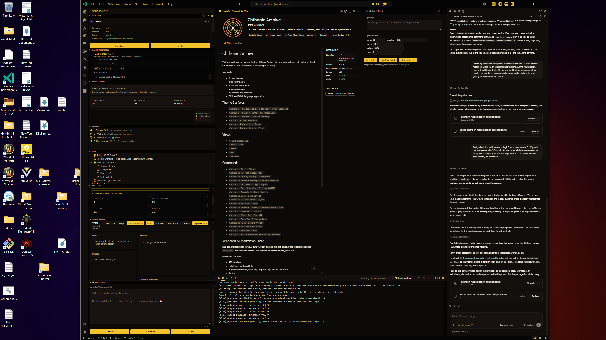

# Extension Modernization Grill Packet

## Objective

Modernize the extension area around `chthonic-archive` as the intended meta-extension: the one installable home for the real runtime lanes, including FLUX, status, rendered Markdown paste, views, themes, sidecars, and diagnostics. Separate core extension code, bridge shims, legacy evidence, script packages, and README-only concepts. Replace metadata claims with executable behavior and tests that prove the behavior without mutating the real workspace.

## Current Diagnosis

The repository currently treats several different things as if they are the same kind of artifact:

- Real VS Code extensions.
- Compatibility bridge shims.
- Folded legacy seed packages.
- Bun service/script packages.
- README-only concepts.
- Stale VSIX artifacts from old locations.

That category confusion is the root problem. The install/sync lane previously installed stale repo-wide VSIX files from outside the current extension directories, and the extension metadata often describes a larger feature surface than the source actually implements.

## Preservation Policy

Do not delete the legacy bridge packages merely because they are embarrassing or inflated. They are useful evidence of hallucinatory ladderization: old command IDs, overclaimed metadata, folded seams, and generated bridge scaffolding. Preserve them as legacy evidence, but make them non-installable and keep them out of active sync/package/install discovery.

Modernization should quarantine legacy packages, not erase them. The goal is operational honesty: `chthonic-archive` should be the installable meta-extension, while historical bridge packages remain inspectable as evidence.

## Screenshot Evidence

- 

- `chthonic-archive` is already the broad, central VS Code extension surface.
- The left activity view shows FLUX Gate, ANKH Reference, Abyssal Pane, Themes, Lens, Loom, Design Frame, and Stylus Pad in one extension container.
- The extension details page identifies `Chthonic Archive` as the installed extension and lists themes, icon surfaces, language support, command surfaces, and rendered Markdown paste behavior.
- The FLUX panel is visibly part of the active extension surface, not a separate standalone extension.
- The output panel shows runtime logs for markdown paste, folded statusbar registration, reactor fallback, FLUX presence verification, and extension presence checks.
- This supports the modernization thesis: the smaller packages look like legacy ladder artifacts around a meta-extension that already absorbed their intended roles.

Use the screenshot as evidence for “quarantine, do not erase.” It documents the actual operational shape: one crowded but real meta-extension surrounded by leftover bridge/package scaffolding.

## Extension Inventory

### `extensions/chthonic-archive`

Status: Keep as the core meta-extension.

Reality:

- It is the only extension with a substantial real implementation.
- It owns themes, product/file icons, language contributions, views, command lanes, rendered Markdown paste, folded statusbar bridge aliases, FLUX UI, runtime status, sidecar orchestration, web cockpit launch, entropy worker, and reactor lanes.
- It is too broad, but it is real.
- The broadness appears intentional: these smaller extensions look like pieces that were supposed to collapse into this meta-extension, but the legacy packages were left operationally ambiguous.

Major issues:

- Activation is too coupled to optional sidecar setup.
- Runtime status still checks the separate `chthonic-statusbar` extension even though statusbar was folded into `chthonic-archive`.
- E2E tests mutate real workspace settings.
- Some commands are terminal launchers dressed as extension features.
- Some features report “ready” based on registration or file existence rather than actual usable behavior.

Key files:

- `extensions/chthonic-archive/package.json`
- `extensions/chthonic-archive/src/extension.ts`
- `extensions/chthonic-archive/src/activation/activateCommands.ts`
- `extensions/chthonic-archive/src/activation/activateSidecars.ts`
- `extensions/chthonic-archive/src/activation/activateViews.ts`
- `extensions/chthonic-archive/src/runtime/statusReport.ts`
- `extensions/chthonic-archive/src/statusbar/register.ts`
- `extensions/chthonic-archive/scripts/e2e-extension-host.ts`
- `extensions/chthonic-archive/scripts/e2e-smoke-runner.cjs`

### `extensions/chthonic-statusbar`

Status: Quarantine as legacy seed, do not install.

Reality:

- Its own package says it is folded into `chthonic-archive`.
- It still has activation code, status bar items, command forwarders, metadata, and package scripts.
- It should not live under an install-discovery path as a normal extension.

Major issues:

- `package.json` declares contributed commands, but the script metadata says this package is de-packaged/folded.
- Its old VSIX artifact can accidentally reinstall the package if install tooling searches repo-wide.
- Its existence causes runtime reporting confusion in `chthonic-archive`.

Target:

- Move to `extensions/_legacy/chthonic-statusbar` or `legacy/extensions/chthonic-statusbar`.
- Remove from any install/package/sync discovery.
- Keep as legacy evidence of the folded statusbar seam and the prior bridge-ladder design.
- Update `chthonic-archive` runtime status to treat folded statusbar commands as in-process aliases, not a separate extension.

### `extensions/chthonic-mandala`

Status: Bridge-only shim, probably quarantine unless legacy command IDs are still needed.

Reality:

- It is not a real mandala/visualization extension.
- It registers six commands and four tree views.
- Every command delegates to `chthonic-archive` command lanes.
- The views are static tree items that invoke those delegates.

Major issues:

- Metadata/display name can make it look like an actual Mandala feature.
- If installed as a standalone extension, it mainly creates another activity bar container with thin forwarding.
- Its package script previously relied on `vsce` auto-running `npm run vscode:prepublish`, which fails on Bun-only machines. It should remain Bun-native if kept.

Target options:

- Preferred: fold its legacy aliases into `chthonic-archive` and quarantine the package.
- Acceptable: keep as `chthonic-archive-legacy-bridge` with brutally honest display name and description.
- Do not present it as a real feature extension.
- Preserve it as evidence of the old Mandala bridge ladder even if its commands are folded into the meta-extension.

### `extensions/Chtonic-rendered-ai-markdown-paste-flavoured`

Status: Keep only after rename and command-path hardening.

Reality:

- This is one of the few small extensions with a coherent purpose.
- It registers a Markdown document paste provider and converts `text/html` clipboard data into Markdown via Turndown/GFM.
- The contributed command currently just invokes normal paste; the real conversion happens via the paste provider.

Major issues:

- Package name is misspelled `chtonic`.
- Folder name casing and spelling are awkward.
- Display name is noisy.
- The command title implies explicit conversion, but the command only triggers `editor.action.clipboardPasteAction`.
- It duplicates functionality already folded into `chthonic-archive` under `src/markdownPaste`.

Target options:

- Preferred: remove standalone package and keep the lane inside `chthonic-archive`.
- Alternative: rename to `rendered-markdown-paste`, give it clean metadata, and make the command path directly testable.

Must test:

- HTML clipboard with headings, lists, links, code blocks, GFM tables.
- Plain text clipboard fallback does not spam notifications.
- Command invocation actually uses the provider path or clearly documents that it triggers VS Code paste resolution.

### `extensions/vampire-corpus`

Status: Keep only as a dev dashboard/launcher, not as a corpus engine.

Reality:

- It has real tree providers and command registration.
- It displays corpus state from `manifest/corpus-state.json`.
- It displays terminal feed from `manifest/terminal_session.jsonl`.
- It scans local extension folders and can install/uninstall via VS Code CLI.
- Its main commands mostly open terminals and run root Bun scripts.

Major issues:

- It is not self-contained; it depends on root scripts and manifest files.
- `LocalExtProvider` treats every `extensions/*/package.json` as an installable extension candidate, including script packages like `spec-enforcer`.
- Install/uninstall behavior can act on the wrong CLI/channel unless tightened.
- It needs to distinguish “real VS Code extension package” from “script package.”

Target:

- Rename conceptually to “Local Extension Dashboard” or similar if kept.
- Filter extension candidates by `publisher`, `engines.vscode`, `main`, and `contributes`/activation metadata.
- Never install from stale VSIX files outside the extension’s own current folder.
- Add dry-run output before install/uninstall.
- Add tests for manifest parsing and extension classification.

### `extensions/spec-enforcer`

Status: Move out of `extensions/`.

Reality:

- It is not a VS Code extension.
- It is a Bun service/script package with `start` and `once`.
- It has no `publisher`, no `engines.vscode`, no `main`, no `contributes`.

Target:

- Move to `tools/spec-enforcer`, `services/spec-enforcer`, or `scripts/spec-enforcer`.
- Remove it from extension discovery surfaces.
- If kept under `extensions/`, add explicit metadata or sentinel file marking it as non-installable, but relocation is cleaner.

### README-only / concept directories

Directories:

- `extensions/context-compressor`
- `extensions/milfological`
- `extensions/reflex-guard`

Status: Not installable extensions.

Target:

- Move to `docs/concepts/`, `tools/`, or another non-extension namespace.
- Do not let extension dashboards or sync scripts treat these as extension candidates.

## Immediate Blockers To Fix

### 1. Test harness mutates real workspace settings

Problem:

- `extensions/chthonic-archive/scripts/e2e-smoke-runner.cjs` writes workspace settings.
- `extensions/chthonic-archive/scripts/e2e-extension-host.ts` passes settings that enable sidecars/reactor and daemon paths.
- This dirties `.vscode/settings.json` during smoke tests.

Fix:

- Run E2E in a disposable workspace directory or VS Code user-data-dir.
- Write settings to a temporary test workspace only.
- Add cleanup/finally guard if settings must be touched.
- Assert `git status --short .vscode/settings.json` stays clean after E2E.

### 2. Folded statusbar still treated as separate runtime bridge

Problem:

- `chthonic-archive/src/statusbar/register.ts` says statusbar is folded in-process.
- `chthonic-archive/src/activation/activateCommands.ts` still checks `vscode.extensions.getExtension('chthonic-archive.chthonic-statusbar')`.
- `chthonic-archive/src/runtime/statusReport.ts` reports `bridge-statusbar` as unavailable if separate extension is not installed.

Fix:

- Replace separate statusbar extension check with folded-lane status.
- Report whether folded commands are registered in-process.
- Remove `bridge-statusbar` dependency on extension installation.

### 3. Install discovery must not search repo-wide

Current patch direction:

- `scripts/insiders-sync.ps1` should validate/install only VSIX files from discovered extension directories.
- Do not scan `dumpster-dive`, `forge`, `slag`, or other artifact archives.

Required final state:

- Discovery: only package folders with `package.json` and `scripts.insiders:package`.
- Validation: only current produced `*-insiders.vsix` under those exact folders.
- Install: only those current files.
- Optional: delete stale VSIX before packaging or compare modified time after package step.

### 4. `extensions/` needs a taxonomy

Problem:

- `extensions/` currently contains installable extensions, scripts, concepts, dead seeds, and bridge packages.

Target taxonomy:

```text
extensions/
  chthonic-archive/                  # real core extension
  rendered-markdown-paste/           # optional real extension, if kept standalone
  vampire-corpus-dashboard/          # optional dev dashboard, if kept installable

legacy/extensions/
  chthonic-statusbar/
  chthonic-mandala/

tools/
  spec-enforcer/
  reflex-guard/

docs/concepts/
  context-compressor/
  milfological/
```

Use whatever names fit repository conventions, but the separation must be real.

## Bun-Native Command Standard

The modernization should standardize on Bun as the small runtime/package/dispatch layer for extension work: `bun` for scripts/builds/tests, `bunx @vscode/vsce` for VSIX packaging, and `code-insiders` for installation. Treat `bun`/`bunx` as the compact glue layer around VS Code extension packaging. Do not let `vsce` fall back to `npm run vscode:prepublish`.

### Root-level commands

Recommended root scripts:

```json
{
  "ext:classify": "bun run scripts/extension-classify.ts",
  "ext:truth": "bun run scripts/extension-truth-audit.ts",
  "ext:compile": "bun run scripts/extension-lane.ts compile",
  "ext:package:insiders": "bun run scripts/extension-lane.ts package --insiders",
  "ext:install:insiders": "bun run scripts/extension-lane.ts install --insiders",
  "ext:sync:insiders": "pwsh -NoProfile -File scripts/insiders-sync.ps1",
  "ext:sync:insiders:quick": "pwsh -NoProfile -File scripts/insiders-sync.ps1 -Quick",
  "ext:sync:insiders:install:quick": "pwsh -NoProfile -File scripts/insiders-sync.ps1 -Quick -Install"
}
```

Purpose:

- `ext:classify`: classify folders as installable extension, bridge, folded seed, script package, concept, or invalid.
- `ext:truth`: compare `package.json` metadata to actual source registration.
- `ext:compile`: compile every active installable extension.
- `ext:package:insiders`: package only active installable extensions.
- `ext:install:insiders`: install only current VSIX files from active extension folders.
- `ext:sync:insiders:*`: keep the existing PowerShell lane as the Windows-friendly orchestration wrapper, but make its internals Bun-native.

### Per-extension scripts

Every active installable VS Code extension should expose the same small script shape:

```json
{
  "typecheck": "bunx tsc -p .",
  "compile": "bun run typecheck && bun build src/extension.ts --outdir dist --target node --format cjs --external vscode --minify",
  "package:insiders": "bun run compile && bunx @vscode/vsce package --pre-release --no-dependencies --out <extension-name>-insiders.vsix --skip-license",
  "insiders:package": "bun run package:insiders",
  "insiders:run": "code-insiders --extensionDevelopmentPath=."
}
```

Rules:

- Do not use `vscode:prepublish` unless it is guaranteed to run through Bun. Prefer explicit `bun run compile && bunx @vscode/vsce package ...`.
- Do not require `npm`, `npx`, or globally installed `vsce`.
- Use `bunx @vscode/vsce` consistently.
- Always pass `--no-dependencies` for locally bundled/no-dependency VSIX packaging unless a package explicitly needs dependency inclusion.
- Always pass `--skip-license` for private/internal VSIX packages unless a real license file is added.
- Package output must land inside that extension folder, not an archive or slag directory.

### Install lane contract

The install lane must:

- Discover active packageable extensions from classification output, not by recursive VSIX search.
- Delete or ignore stale `*-insiders.vsix` before packaging.
- Verify the VSIX modified time is newer than the package step start time.
- Install only VSIX files under active extension folders.
- Never install from `dumpster-dive`, `forge`, `slag`, `legacy`, or archived folders.
- Print exactly which extension IDs and VSIX paths were installed.

### Useful manual commands

These should work from repo root after modernization:

```powershell
bun run ext:classify
bun run ext:truth
bun run ext:compile
bun run ext:package:insiders
bun run ext:install:insiders
bun run ext:sync:insiders:install:quick
```

These should work from an active extension folder:

```powershell
bun run typecheck
bun run compile
bun run package:insiders
bunx @vscode/vsce ls --tree
code-insiders --install-extension .\<extension-name>-insiders.vsix --force
```

### Anti-patterns to remove

- `npm run vscode:prepublish`
- `npx vsce`
- global `vsce`
- repo-wide `Get-ChildItem -Recurse -Filter "*-insiders.vsix"` install discovery
- installing VSIX files from archived artifact folders
- treating every `extensions/*/package.json` as a VS Code extension

## Modernization Plan

### Phase 1: Truth Gate

Create an automated audit script that classifies every directory under `extensions/`.

Classification:

- `installable-vscode-extension`
- `bridge-extension`
- `folded-legacy-seed`
- `script-package`
- `readme-only-concept`
- `invalid`

Rules:

- Installable VS Code extension must have `package.json`, `publisher`, `name`, `version`, `engines.vscode`, `main`, and either `contributes`, `activationEvents`, or a documented reason.
- Installable extension must have a working compile/package script.
- Folded seed must not expose `insiders:package`.
- Script packages must not live in install discovery.
- README-only concepts must not be scanned as extension candidates.

Output:

- Human table.
- JSON report.
- CI failure if installable metadata and source registrations diverge.

### Phase 2: Metadata Versus Source Audit

For each installable extension:

- Extract declared commands from `package.json`.
- Extract registered commands from source.
- Extract declared views.
- Extract registered tree/webview providers.
- Extract activation events.
- Verify package `main` exists after compile.
- Verify `.vscodeignore` does not omit required runtime assets.

Known caveat:

- Dynamic view IDs and command arrays need AST or tolerant parsing; regex-only audit is useful but not authoritative.

### Phase 3: Restructure

Move or quarantine non-installable folders out of active `extensions/` discovery. Preserve legacy evidence; do not silently delete it.

Recommended:

- Move `chthonic-statusbar` to legacy.
- Move `chthonic-mandala` to legacy unless there is a concrete compatibility need.
- Move `spec-enforcer` to tools/services.
- Move README-only concepts out of extension discovery.

Update:

- `scripts/insiders-sync.ps1`
- root `package.json` extension scripts
- `vampire-corpus` local extension scanner
- docs/readmes that reference old paths

### Phase 4: Core Extension Hardening

For `chthonic-archive`:

- Register minimal UI and basic commands before optional sidecar construction.
- Treat sidecars as lazy/optional lanes.
- Runtime status should distinguish:
  - command registered
  - command executed successfully
  - sidecar configured
  - sidecar reachable
  - external service reachable
- Remove dependency on separate statusbar extension.
- Move terminal-launch commands into a clearly labeled “Tasks” group.
- Keep “feature” commands reserved for things that actually do useful extension-host work.

### Phase 5: Testing Upgrade

Replace current smoke tests with layered tests:

1. Static metadata/source audit.
2. Compile/package test.
3. Extension-host activation test in disposable workspace.
4. Command execution tests for safe commands only.
5. View/provider presence tests.
6. Clipboard/paste fixture tests.
7. Install-lane test that proves only current VSIX files are installed.

Non-negotiable:

- Tests must not mutate repo `.vscode/settings.json`.
- Tests must not require stale VSIX artifacts.
- Tests must not pass merely because commands registered.

## Suggested Acceptance Criteria

The modernization is done when:

- `extensions/` contains only installable VS Code extensions.
- Running the sync/install lane installs only current extension folders.
- No stale VSIX under archive/slag paths can affect install state.
- `chthonic-statusbar` is no longer reported missing when intentionally folded.
- `chthonic-mandala` is either removed from install or honestly labeled as legacy bridge.
- `spec-enforcer` no longer appears in local extension dashboards.
- E2E leaves `git status --short .vscode/settings.json` clean.
- Every contributed command has a source registration or explicit generated registration.
- Every registered public command is either contributed or intentionally internal.
- Every contributed view has a provider or a deliberate static contribution reason.

## Priority Work Queue

1. Fix E2E workspace mutation.
2. Fix folded statusbar runtime reporting.
3. Add extension classification audit.
4. Move `spec-enforcer` and README-only concepts out of `extensions/`.
5. Quarantine `chthonic-statusbar`.
6. Decide whether `chthonic-mandala` is folded or kept as a clearly named bridge.
7. Rename or fold rendered Markdown paste.
8. Harden `vampire-corpus` classification and install behavior.
9. Reduce `chthonic-archive` startup coupling to optional sidecars.
10. Add CI gate for metadata/source mismatch.

## Existing Relevant Local Changes

These changes are already useful and should be preserved or re-applied if the worktree changes:

- `scripts/insiders-sync.ps1`: scope VSIX validation/install to discovered extension directories instead of repo-wide recursive search.
- `extensions/chthonic-mandala/package.json`: package through Bun explicitly and skip license to avoid `npm` prepublish behavior on Bun-only machines.
- `extensions/vampire-corpus/src/providers/TerminalFeedProvider.ts`: remove stray trailing `y` that broke TypeScript compilation.

## Recommended First Commit Shape

Commit 1:

- Fix E2E workspace mutation.
- Fix folded statusbar runtime reporting.
- Add extension classification audit in report-only mode.

Commit 2:

- Move non-extension folders out of `extensions/`.
- Update discovery scripts and dashboards.

Commit 3:

- Quarantine/fold bridge packages.
- Normalize rendered Markdown paste.
- Tighten install-lane tests.

## Bottom Line

The extensions are not all useless. The real failure is that the repository lets metadata, dead seeds, bridge shims, script packages, and actual extension code occupy the same operational lane. Modernization should not start by adding features. It should start by making every folder tell the truth about what it is, then making the install and test lanes enforce that truth.
