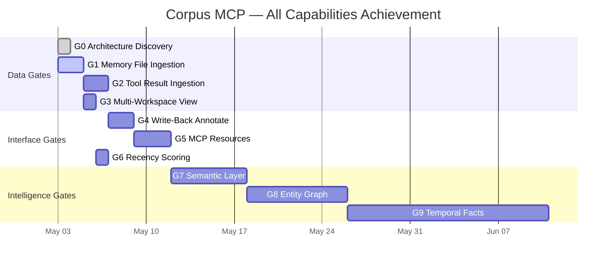

# Corpus MCP — Achievement Gate Ladder: All Capabilities

> **Status:** G0 open (architecture discovered 2026-05-03) — G1 ready to implement  
> **Goal:** Achieve 100% of all capabilities in the comparative analysis table  
> **Source:** `docs/reference/CORPUS_COMPARATIVE_ANALYSIS.md`  
> **Commit baseline:** `050dcf0c` (analysis doc)

---

## VS Code Copilot Chat Storage Architecture (Gate 0 Discovery)

Four data layers found. We currently only ingest **Layer 1**:

| Layer | Path | Status | Contents |
|-------|------|--------|----------|
| **L1 Transcripts** | `workspaceStorage/{hash}/GitHub.copilot-chat/transcripts/{session}.jsonl` | ✅ Ingested | Full conversation JSONL (13 sessions across 3 workspace hashes) |
| **L2 Session Memories** | `workspaceStorage/{hash}/GitHub.copilot-chat/memory-tool/memories/{base64(sessionId)}/` | ⚠️ Wired, not triggered | Per-session `/memories/session/` files (md, json). Watcher code exists but sessions predated it. 10 files found across 2 sessions. |
| **L3 Global Memories** | `globalStorage/github.copilot-chat/memory-tool/memories/` | ❌ Not ingested | User-level `/memories/*.md` persisting across all workspaces. 5 files: chthonic-terminal-workflow, co-supplementary-learnings, ssot-discipline, tabbyapi-py314-gate-state, vulkan-experimental-project |
| **L4 Session Resources** | `workspaceStorage/{hash}/GitHub.copilot-chat/chat-session-resources/{session}/{callId}/` | ❌ Not ingested | Tool call result files (33 files in current session). Named by callId. This is the `resultPreview` data. |

**Session memory base64 derivation:** `Buffer.from(sessionId).toString("base64")`  
**Watcher already implements:** `mirrorAuxiliaries()` in `scripts/session-watcher.ts` lines 84–111  
**Gap:** Older sessions never re-synced; global memories have no session to attach to.

---

## Capability Achievement Map

Current status against ALL capabilities identified in the comparative analysis:

| # | Capability | Status | Gate |
|---|-----------|--------|------|
| 1 | FTS / keyword search | ✅ FTS5 | — |
| 2 | Full session transcript fidelity | ✅ 14,277 messages | — |
| 3 | Dev-workflow metadata (tool calls, edits, cmds, commits) | ✅ 12,149 / 1,372 / 4,063 / 457 | — |
| 4 | Cross-session hot-file ranking | ✅ `hot_files` view | — |
| 5 | Tool usage frequency analytics | ✅ `corpus_tool_freq` tool | — |
| 6 | Session topic classification | ✅ regex (2 unclassified) | G7 upgrades |
| 7 | Agent warm-start resume packet | ✅ `corpus_session_context` tool | — |
| 8 | SQL sandbox | ✅ `corpus_sql` tool | — |
| 9 | Zero-dep local deployment | ✅ Bun + SQLite | — |
| 10 | Commit ref cross-session tracking | ✅ 457 refs | — |
| 11 | Terminal command history | ✅ 4,063 rows | — |
| 12 | **Session memory ingestion** | ⚠️ 0 rows (wired, needs re-sync) | **G1** |
| 13 | **Global memory ingestion** | ❌ Not implemented | **G1** |
| 14 | **Tool result content (resultPreview)** | ❌ Column missing | **G2** |
| 15 | **Multi-workspace ingestion** | ⚠️ 13 sessions across 3 hashes (already works, not visible) | **G3** |
| 16 | **Write-back (agent stores observations)** | ❌ corpus-mcp.ts is read-only | **G4** |
| 17 | **MCP Resources (URI scheme)** | ❌ Tools only | **G5** |
| 18 | **Recency + relevance scoring** | ❌ Linear time ordering only | **G6** |
| 19 | **Semantic / vector search** | ❌ FTS5 only | **G7** |
| 20 | **Semantic topic classification** | ⚠️ Regex (2 gaps) | **G7** |
| 21 | **LLM-generated session summaries** | ❌ Not implemented | **G8** |
| 22 | **Entity extraction / knowledge graph** | ❌ Not implemented | **G8** |
| 23 | **Cross-session entity relationships** | ❌ Not implemented | **G8** |
| 24 | **Temporal fact invalidation** | ❌ Not implemented | **G9** |

**Current score: 11/24 (46%) → Target: 24/24 (100%)**

---

## Gate Architecture

```
G0 ──► G1 ──► G2 ──► G3
                          \
                           ──► G4 ──► G5 ──► G6 ──► G7 ──► G8 ──► G9
```

G0→G3 are data-layer gates (ingesting what VS Code already has).  
G4→G6 are interface gates (how the corpus speaks to agents).  
G7→G9 are intelligence gates (semantic + graph + temporal).

---

## Gate G0 — Architecture Discovery
**Status: ✅ OPEN (2026-05-03)**  
**Delivers:** #12 partial, #14 partial, #15 partial understanding  
**Blocker:** None — pure archaeology  
**Can-opener → G1:** Found that `mirrorAuxiliaries()` exists in session-watcher.ts, memory path formula is `base64(sessionId)`, global memories live at `globalStorage/github.copilot-chat/memory-tool/memories/`

---

## Gate G1 — Memory File Ingestion
**Status: 🔜 READY**  
**Delivers:** Capabilities #12, #13 → memory_snapshots from 0 to ~15+ rows  
**Effort:** ~2h  

### Two sub-problems:

**G1a — Session memories (re-sync):**
The watcher already has the code. Sessions need re-mirroring with the current code.
```powershell
# Re-sync all sessions (picks up memory files for any session that has them)
bun run scripts/session-watcher.ts --once --verbose
# Then rebuild corpus
bun run session:corpus:rebuild
```

**G1b — Global memories (new ingestion path):**
New script: `scripts/memory-ingester.ts`
- Reads `globalStorage/github.copilot-chat/memory-tool/memories/*.md`
- Upserts into `memory_snapshots` table with `sessionId = '_global_'`
- Also creates a synthetic sessions row for `_global_` if needed
- Run at corpus build time + as a separate `session:corpus:memories` script

### Schema addition for G1b:
```sql
-- sessions table already exists; add special row:
INSERT OR IGNORE INTO sessions (sessionId, startTime, ingestedAt)
VALUES ('_global_', '2000-01-01T00:00:00Z', CURRENT_TIMESTAMP);
```

**New MCP tool (G1 bonus):** `corpus_memories` — retrieves all ingested memory snapshots grouped by session/global.

**Blocker:** None — all paths known  
**Can-opener → G2:** Knowing that `chat-session-resources/{callId}/` files exist gives us the tool result data source

---

## Gate G2 — Tool Result Ingestion (resultPreview)
**Status: 🔜 NEXT AFTER G1**  
**Delivers:** Capability #14 → tool_calls.resultPreview column populated  
**Effort:** ~2h  

### What exists:
`workspaceStorage/{hash}/GitHub.copilot-chat/chat-session-resources/{sessionId}/{callId}/`
- 33 files in current session directory
- Each file named by callId (e.g. `toolu_bdrk_01...`, `call_MHx...`)
- Contains the tool call result as raw content

### Implementation:
1. Add `resultPreview TEXT` column via `tryAlter` in session-corpus.ts
2. Extend `mirrorAuxiliaries()` in session-watcher.ts to also copy `chat-session-resources/{sessionId}/*.` files → `manifest/sessions/{sessionId}/tool-results/{callId}`
3. At ingest time in session-corpus.ts: after inserting tool_calls, scan `tool-results/` dir and UPDATE resultPreview by callId match

**New MCP tool (G2 bonus):** `corpus_tool_result` — fetch the result for a specific tool call by callId.

**Blocker:** Need to verify callId in tool_calls matches the filename in chat-session-resources  
**Can-opener → G3:** Richer per-session data reveals the multi-workspace stitching value

---

## Gate G3 — Unified Multi-Workspace View
**Status: 🟡 PARTIALLY WORKING**  
**Delivers:** Capability #15 → all 13 sessions visible regardless of workspace origin  
**Effort:** ~1h  

### Current state:
The watcher already scans ALL workspace hashes. The 13 sessions in corpus come from 3 workspace hashes:
- `710554437afe84ae...` → 10 sessions
- `eccd2abdbb1acd06...` → 2 sessions  
- `ef54bace47120bf8...` → 1 session

### Missing piece:
`corpus_timeline` doesn't expose `workspaceHash`. Users can't tell which workspace a session originated from.

### Implementation:
1. Add `workspaceHash TEXT` column to sessions table via `tryAlter` (read from `meta.json` at ingest)
2. Expose in `corpus_timeline` output
3. Add `--workspace` filter to `corpus_timeline` MCP tool

**No new code needed for ingestion** — already working. This is a metadata enrichment gate.

---

## Gate G4 — Write-Back (corpus_annotate)
**Status: ⬜ QUEUED**  
**Delivers:** Capability #16 → agent can store observations in corpus (closing biggest gap vs MCP Memory)  
**Effort:** ~2h  

### New MCP tools:
```typescript
// corpus_annotate: write observations/labels to sessions
corpus_annotate(sessionId, { topic?, tags?, note? })
  → UPDATE sessions SET topic=?, tags=?, note=? WHERE sessionId=?

// corpus_memory_write: inject a memory snapshot programmatically  
corpus_memory_write(sessionId | '_global_', filename, content)
  → INSERT INTO memory_snapshots ...
```

### Security constraint:
- Only allow UPDATE to: `topic`, `tags`, `note` (user-defined columns)
- Never allow raw SQL writes via this tool
- Keep `corpus_sql` as SELECT-only

**Blocker:** Requires adding `note TEXT` column to sessions via tryAlter  
**Can-opener → G5:** Write-back makes MCP Resources natural (agents need to both read AND write URIs)

---

## Gate G5 — MCP Resources (URI Scheme)
**Status: ⬜ QUEUED**  
**Delivers:** Capability #17 → better Copilot integration via ResourceTemplate  
**Effort:** ~3h  

### Resources to expose:
```
corpus://sessions           → full timeline
corpus://sessions/{id}      → single session context
corpus://files/{path}       → edit history for a file path
corpus://memories/global    → all global memory files
corpus://memories/{sessionId} → session-specific memories
corpus://hot-files          → ranked file list
```

### Implementation in corpus-mcp.ts:
```typescript
server.setRequestHandler(ListResourceTemplatesRequestSchema, async () => ({
  resourceTemplates: [
    { uriTemplate: "corpus://sessions/{id}", name: "Session Context", ... },
    { uriTemplate: "corpus://memories/{scope}", name: "Memory Files", ... },
  ]
}));
server.setRequestHandler(ReadResourceRequestSchema, async (request) => {
  const { uri } = request.params;
  // parse uri → query → return as Resource
});
```

**Blocker:** Requires `@modelcontextprotocol/sdk` ResourceTemplate support (check SDK version)  
**Can-opener → G6:** URI scheme makes recency scoring natural (agents query by URI, get ranked results)

---

## Gate G6 — Recency + Relevance Scoring
**Status: ⬜ QUEUED**  
**Delivers:** Capability #18 → sessions ranked by composite recency+signal score  
**Effort:** ~1h  

### Formula:
```
recencyScore = exp(-daysSinceSession * λ)   where λ = 0.1 (half-life ≈ 7 days)
signalScore  = turns * 0.4 + uniqueFiles * 0.3 + commits * 0.3  (normalized)
compositeScore = 0.6 * recencyScore + 0.4 * signalScore
```

### Implementation:
- Add computed column or VIEW: `session_ranked` with composite score
- Expose as default ordering in `corpus_timeline`
- Add `--ranked` flag to `session-query.ts` 

**Blocker:** None  
**Can-opener → G7:** Scoring reveals which sessions are worth embedding first

---

## Gate G7 — Semantic Layer (sqlite-vec)
**Status: ⬜ QUEUED**  
**Delivers:** Capabilities #19, #20 → vector search + semantic classification  
**Effort:** ~6h  

### Stack:
- `sqlite-vec` extension (SQLite ANN via `vec_f32` columns)
- `nomic-embed-text` via Ollama (768-dim, ~2ms/doc on RTX 4090)
- Already in ecosystem (tabbyAPI uses Ollama)

### New tables:
```sql
CREATE TABLE session_embeddings (
  sessionId TEXT PRIMARY KEY REFERENCES sessions(sessionId),
  embedding BLOB  -- vec_f32(768)
);
```

### New script: `scripts/embed-corpus.ts`
```typescript
// For each session: embed intent + hot files summary via Ollama
// Store in session_embeddings
```

### New MCP tool: `corpus_similarity`
```typescript
// embed query → vec_distance_cosine → top-K sessions
corpus_similarity(query: string, topK?: number)
```

### Classification upgrade:
Replace TOPIC_SIGS regex with: embed session intent → cosine similarity to topic vectors → assign topic  
Fixes the 2 unclassified sessions.

**Blocker:** sqlite-vec Bun loading (need to verify `Database.loadExtension()` path on Win32)  
**Can-opener → G8:** Embeddings already computed → entity extraction is the next enrichment layer

---

## Gate G8 — Entity Graph
**Status: ⬜ QUEUED**  
**Delivers:** Capabilities #21, #22, #23 → summaries + entity nodes + cross-session relations  
**Effort:** ~8h  

### Three sub-problems:

**G8a — LLM session summaries:**
- Call local model (tabbyAPI) with session context → `summary TEXT` column on sessions
- New MCP tool: `corpus_summarize(sessionId)` — returns/generates summary

**G8b — File entity graph:**
```sql
CREATE TABLE file_sessions (
  filePath TEXT NOT NULL,
  sessionId TEXT NOT NULL,
  editCount INTEGER DEFAULT 0,
  PRIMARY KEY (filePath, sessionId)
);
```
Built from existing `file_edits`. `corpus_related` tool: files most co-edited with the queried file.

**G8c — Cross-session entity relations:**
- Extract named entities (file paths, commit hashes, tool names) from memories + transcripts
- Build `entity_refs` table: `(entityType, entityName, sessionId, occurrences)`
- Exposes graph edges: session × entity × session

**New MCP tools:** `corpus_related`, `corpus_entity_graph`

**Blocker:** tabbyAPI must be running for G8a  
**Can-opener → G9:** Entity graph with validity dates → Graphiti temporal layering becomes a thin upgrade

---

## Gate G9 — Temporal Facts (Graphiti Integration)
**Status: ⬜ QUEUED (long-term)**  
**Delivers:** Capability #24 → temporal fact invalidation  
**Effort:** ~16h  

### Architecture:
- Graphiti OSS (Python sidecar: `apps/graphiti-sidecar/`)
- Extracts entities from memory_snapshots + messages
- Assigns validity ranges: `(entity, fact, valid_from, valid_until, confidence)`
- MCP bridge: `corpus_temporal_search(query, at_time?)` → facts valid at the given timestamp

### Entry condition:
G8 complete — entity graph must exist before temporal layering makes sense.

---

## Roadmap Summary



---

## Score Progression

| After Gate | Capabilities Delivered | Score |
|-----------|----------------------|-------|
| Now (G0 open) | 11/24 | 46% |
| G1 (memories) | +2 → 13/24 | 54% |
| G2 (tool results) | +1 → 14/24 | 58% |
| G3 (multi-workspace) | +1 → 15/24 | 63% |
| G4 (write-back) | +1 → 16/24 | 67% |
| G5 (MCP Resources) | +1 → 17/24 | 71% |
| G6 (recency) | +1 → 18/24 | 75% |
| G7 (semantic) | +2 → 20/24 | 83% |
| G8 (entity graph) | +3 → 23/24 | 96% |
| G9 (temporal) | +1 → 24/24 | **100%** |

---

## Immediate Next Actions (G1 execution)

```powershell
# Step 1: Re-sync sessions (picks up memory files the watcher missed)
bun run scripts/session-watcher.ts --once --verbose

# Step 2: Rebuild corpus from re-synced sessions
bun run session:corpus:rebuild

# Step 3: Verify memory_snapshots > 0
bun run scripts/session-query.ts --sql "SELECT COUNT(*) FROM memory_snapshots"

# Step 4: Build memory-ingester.ts for global memories
# → scripts/memory-ingester.ts (new file)

# Step 5: Verify global memories ingested
bun run scripts/session-query.ts --sql "SELECT sessionId, filename FROM memory_snapshots LIMIT 20"
```
