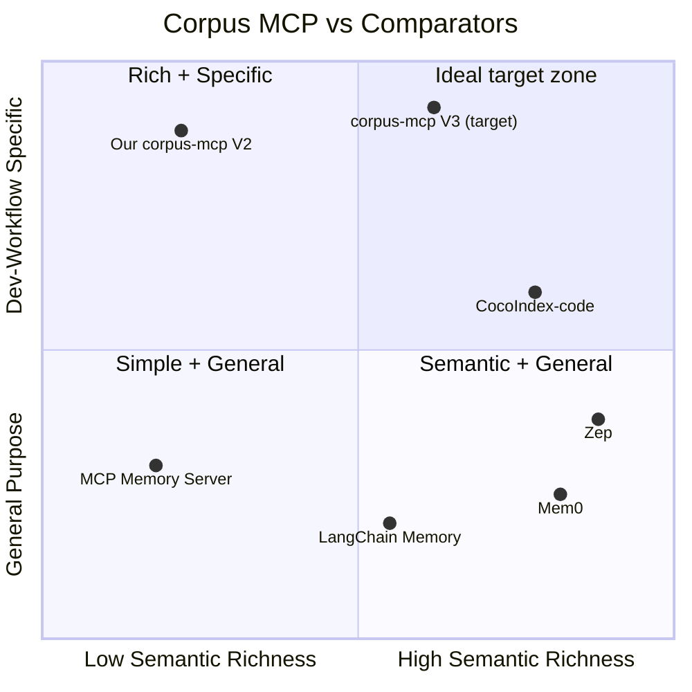
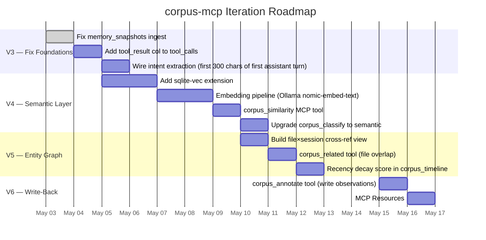

# Corpus MCP — Comparative Analysis & Improvement Roadmap

> **Generated:** 2026-05-03  
> **Scope:** `manifest/corpus.sqlite` + `scripts/corpus-mcp.ts` vs. comparable agent-memory / MCP-server systems  
> **Purpose:** Surface capability gaps, confirm our differentiators, and produce an ordered iteration plan.

---

## 1. Systems Under Comparison

| # | System | Category | Storage | Transport |
|---|--------|----------|---------|-----------|
| A | **Our corpus-mcp** | Dev-workflow MCP server | SQLite + FTS5 | stdio (Bun) |
| B | **MCP Memory Server** (Anthropic ref) | General knowledge-graph MCP | JSONL flat file | stdio (npx) |
| C | **Mem0** | Managed memory layer | Vector + KV (cloud) | REST API |
| D | **Zep** (Graphiti) | Temporal context graph | Vector + Graph (cloud/OSS) | REST API |
| E | **LangChain Memory** | Framework memory patterns | Various (pluggable) | Library calls |
| F | **CocoIndex-code** (already in `.mcp.json`) | Semantic code search | Vector index | stdio |

---

## 2. Feature Comparison Matrix

| Capability | Our corpus-mcp | MCP Memory | Mem0 | Zep | LangChain | CocoIndex |
|-----------|:-:|:-:|:-:|:-:|:-:|:-:|
| **Keyword / FTS search** | ✅ FTS5 | ⚠️ string match | ✅ | ✅ | ⚠️ partial | ❌ |
| **Semantic / vector search** | ❌ | ❌ | ✅ embeddings | ✅ embeddings | ✅ optional | ✅ |
| **Session / conversation history** | ✅ full fidelity | ❌ | ✅ per-user | ✅ per-thread | ✅ | ❌ |
| **Structured session metadata** | ✅ (tool calls, edits, cmds, commits) | ❌ | ❌ | ❌ | ❌ | ❌ |
| **Cross-session hot-file ranking** | ✅ | ❌ | ❌ | ❌ | ❌ | ❌ |
| **Tool usage frequency analytics** | ✅ | ❌ | ❌ | ❌ | ❌ | ❌ |
| **Entity extraction (people, files, concepts)** | ⚠️ files only | ✅ typed entities | ✅ | ✅ temporal | ✅ KG mode | ❌ |
| **Cross-session entity graph** | ❌ | ✅ (flat KG) | ✅ | ✅ (temporal) | ⚠️ | ❌ |
| **Temporal fact invalidation** | ❌ | ❌ | ⚠️ | ✅ | ❌ | ❌ |
| **Automatic session summarization** | ⚠️ intent field only | ❌ | ✅ | ✅ | ✅ Summary | ❌ |
| **Session topic classification** | ✅ regex scoring | ❌ | ❌ | ❌ | ❌ | ❌ |
| **Agent warm-start / resume packet** | ✅ corpus_session_context | ❌ | ❌ | ⚠️ context blocks | ❌ | ❌ |
| **Read-only SQL sandbox** | ✅ | ❌ | ❌ | ❌ | ❌ | ❌ |
| **Write-back / note injection** | ❌ | ✅ | ✅ | ✅ | ✅ | ❌ |
| **MCP Resources (not just Tools)** | ❌ | ❌ | ❌ | ❌ | ❌ | ❌ |
| **Streaming responses** | ❌ | ❌ | ❌ | ⚠️ | ❌ | ❌ |
| **Relevance decay / recency weighting** | ❌ | ❌ | ⚠️ | ✅ | ⚠️ | ❌ |
| **Fully local / air-gapped** | ✅ | ✅ | ❌ cloud | ⚠️ OSS exists | ✅ | ✅ |
| **Zero external deps** | ✅ Bun+SQLite | ✅ npx | ❌ | ❌ | ❌ | ❌ |
| **Memory snapshot ingestion** | ⚠️ schema exists, 0 rows | ❌ | ❌ | ❌ | ❌ | ❌ |
| **Tool result capture** | ❌ not stored | ❌ | ❌ | ❌ | ❌ | ❌ |
| **Code block tracking** | ✅ lang + lines | ❌ | ❌ | ❌ | ❌ | ✅ |
| **Commit ref cross-session tracking** | ✅ | ❌ | ❌ | ❌ | ❌ | ❌ |
| **Terminal command history** | ✅ | ❌ | ❌ | ❌ | ❌ | ❌ |

**Legend:** ✅ = full support · ⚠️ = partial / optional · ❌ = not present

---

## 3. Positioning Diagram



**Interpretation:**
- We are currently the only system in the high-specificity column, but low on semantic richness.
- The target zone (quadrant 2) requires adding the vector/semantic layer while keeping our unique dev-workflow specificity.
- CocoIndex-code already covers semantic code search — we should federate with it rather than re-implement it.

---

## 4. Architecture Comparison

```mermaid
graph TD
    subgraph "Our corpus-mcp (current)"
        A1["transcript.jsonl\n(raw source)"] --> A2["session-corpus.ts\n(ingestion + classification)"]
        A2 --> A3["corpus.sqlite\n(SQLite + FTS5)"]
        A3 --> A4["corpus-mcp.ts\n(9 MCP tools)"]
        A4 --> A5["VS Code Copilot\n(MCP client)"]
        style A3 fill:#2a4,color:#fff
    end

    subgraph "MCP Memory Server (Anthropic)"
        B1["Agent observations"] --> B2["memory.jsonl\n(flat KG store)"]
        B2 --> B3["9 tools\n(entity/relation/observe)"]
        B3 --> B5["Any MCP client"]
    end

    subgraph "Zep (temporal graph)"
        C1["Chat messages\nBusiness data"] --> C2["Graph construction\n(entity extraction)"]
        C2 --> C3["Temporal KG\n(Graphiti + vector)"]
        C3 --> C4["Context assembly\n(<200ms retrieval)"]
        C4 --> C5["Agent frameworks"]
    end

    subgraph "Gap bridge (V3 target)"
        D1["corpus.sqlite"] --> D2["sqlitev-vec\n(vector col)"]
        D2 --> D3["Embedding pipeline\n(Ollama / local model)"]
        D3 --> D4["corpus_similarity tool"]
        D1 --> D5["Entity graph\n(files × sessions)"]
    end
```



---

## 5. Gap Analysis — Prioritized

### 5.1 High Impact / Low Effort

| Gap | Root Cause | Signal |
|-----|-----------|--------|
| **Memory snapshots 0 rows** | Schema exists, ingest loop never writes to it | `SELECT COUNT(*) FROM memory_snapshots` = 0 |
| **Tool results not captured** | `tool_calls` has args but no result column | Success rate unreliable without output |
| **Intent field is empty string** | Extraction logic not wired | 0 sessions have useful intent |

### 5.2 High Impact / Medium Effort

| Gap | What it enables |
|-----|----------------|
| **Semantic search (sqlite-vec)** | "Find sessions similar to this context" — replaces pure keyword FTS5 |
| **Cross-session entity graph** | "Which files changed across vulkan + tabby sessions?" — structural knowledge |
| **Relevance decay** | Recent sessions weighted higher for routing; stale sessions auto-deprioritize |
| **Automatic session summarization** | LLM-generated `summary` column in sessions table — better intent + routing |

### 5.3 Medium Impact / Low Effort

| Gap | Notes |
|-----|-------|
| **Write-back tool** | Agent can inject observations back into corpus (e.g. "label this session as blocked") |
| **MCP Resources** | Expose corpus views as URI resources (e.g. `corpus://sessions/{id}`) |
| **`corpus_related` tool** | Given a session ID, find top-N similar sessions by file overlap or tag intersection |

### 5.4 Low Priority / High Effort

| Gap | Why deferred |
|-----|-------------|
| **Full temporal graph (Graphiti)** | Zep's graphiti is the gold standard; integrating it requires a Go/Python service |
| **Streaming responses** | MCP SDK supports it but corpus SQL results are small — not a bottleneck yet |

---

## 6. Improvement Plan



---

## 7. Iteration 1 Detail (V3 — Fix Foundations)

Three quick wins that fix data quality before adding features.

### 7.1 Memory Snapshots Ingest Fix

**Problem:** `memory_snapshots` table has schema but `ingestSession()` never writes to it. The `memories/*.md` files are present in `manifest/sessions/*/` but the loop skips them.

**Fix:** In `session-corpus.ts → ingestSession()`, after the `debug.jsonl` block, add:
```ts
// memories/*.md → memory_snapshots
const memoriesDir = join(sessionDir, "memories");
if (existsSync(memoriesDir)) {
  for (const f of readdirSync(memoriesDir)) {
    if (!f.endsWith(".md")) continue;
    const content = readFileSync(join(memoriesDir, f), "utf8");
    db.prepare(`INSERT OR REPLACE INTO memory_snapshots
      (sessionId, filename, content, capturedAt) VALUES (?,?,?,?)`)
      .run(sid, f, content, new Date().toISOString());
  }
}
```

### 7.2 Tool Result Column

**Problem:** `tool_calls.success` is inferred from whether a completion record appeared, but the actual result/output is never stored. This makes failure diagnosis opaque.

**Migration:** Add `resultPreview TEXT` column (first 500 chars of tool result). ALTER TABLE is safe since corpus is rebuilt on `--rebuild`.

### 7.3 Intent Extraction

**Problem:** `sessions.intent` is empty string for all classified sessions. Intent should be the first 300 chars of the first `assistant` message in the session.

**Fix:** After messages are inserted, run:
```ts
const firstAssist = db.prepare(
  "SELECT content FROM messages WHERE sessionId=? AND role='assistant' ORDER BY turn ASC LIMIT 1"
).get(sid) as { content: string } | undefined;
if (firstAssist) {
  db.prepare("UPDATE sessions SET intent=? WHERE sessionId=?")
    .run(firstAssist.content.slice(0, 300), sid);
}
```

---

## 8. Iteration 2 Detail (V4 — Semantic Layer)

### 8.1 sqlite-vec

[sqlite-vec](https://github.com/asg017/sqlite-vec) is a SQLite extension that adds a `vec_f32` column type and `vec_distance_cosine()` for ANN search. Bun can load it via `Database.loadExtension()`.

**Architecture:**
```
sessions.intent + summary → embed(nomic-embed-text) → vec_f32[768] → sessions.embedding
corpus_similarity(query_text) → embed(query) → vec_distance_cosine → top-K sessions
```

**New tool: `corpus_similarity`**
```
Input: { query: string, limit?: number }
Output: [{ sessionId, topic, intent, distance, tags }]
```

This replaces regex TOPIC_SIGS for routing with genuine semantic nearest-neighbor.

### 8.2 Embedding Model Choice

| Model | Dims | Local? | Speed (RTX 4090) |
|-------|------|--------|-----------------|
| `nomic-embed-text` (Ollama) | 768 | ✅ | ~2ms/doc |
| `mxbai-embed-large` (Ollama) | 1024 | ✅ | ~4ms/doc |
| `text-embedding-ada-002` (OpenAI) | 1536 | ❌ | 100ms + cost |

**Recommended:** `nomic-embed-text` via Ollama — already in ecosystem (tabbyAPI stack), zero cost, 768-dim is sufficient for 13 sessions.

---

## 9. Unique Differentiators to Preserve

These are capabilities that **no other system** in the comparison has. They should never be degraded:

1. **`corpus_session_context` warm-start packet** — instant resume for any past session with all relevant context pre-assembled
2. **Terminal command history cross-session** — unique forensic record of agent execution
3. **Commit ref tracking** — links code changes to sessions; no memory system does this
4. **Tool call frequency analytics** — tells us which MCP tools are overused/failing
5. **Hot file ranking** — structural insight into which files are most active across sessions
6. **Zero-dep local deployment** — pure Bun + SQLite, no cloud, no auth, instant startup
7. **Read-only SQL sandbox** — full SQL expressivity for ad-hoc queries via MCP

---

## 10. Summary Verdict

| Dimension | Score (vs best-in-class) | Next Action |
|-----------|--------------------------|-------------|
| Dev-workflow specificity | 10/10 — best in class | Preserve |
| Search quality | 4/10 — FTS5 only | Add sqlite-vec (V4) |
| Data completeness | 5/10 — memory+results missing | Fix memory_snapshots + tool_result (V3) |
| Cross-session intelligence | 3/10 — regex classify only | entity graph + semantic routing (V4/V5) |
| Write-back capability | 0/10 — read-only | corpus_annotate (V6) |
| Performance | 9/10 — 60ms startup, instant SQL | No action needed |
| Operational simplicity | 10/10 — zero infra | Preserve |
